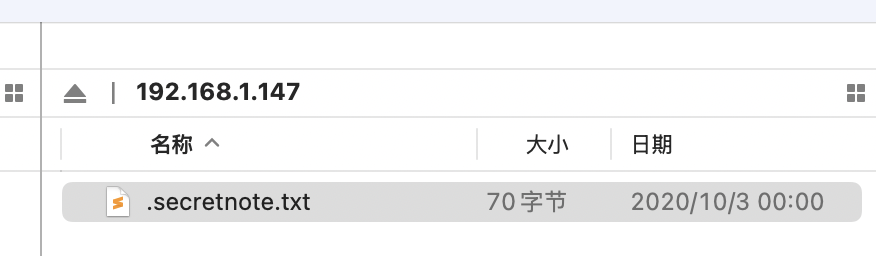

# Alzheimer

fscan扫描

```
192.168.1.147:21 open
[*] alive ports len is: 1
start vulscan
[+] ftp 192.168.1.147:21:anonymous
```

发现`ftp`匿名登录



发现`.secretnote.txt`，内容为

```
I need to knock this ports and 
one door will be open!
1000
2000
3000
```

使用`knock`访问这三个端口

```
knock -v 192.168.1.147 1000 2000 3000 -d 1000
```

但是一直没有成功，看了wp发现改了网卡就不行，因为接口被写死了，读vmdk文件内容找的flag

