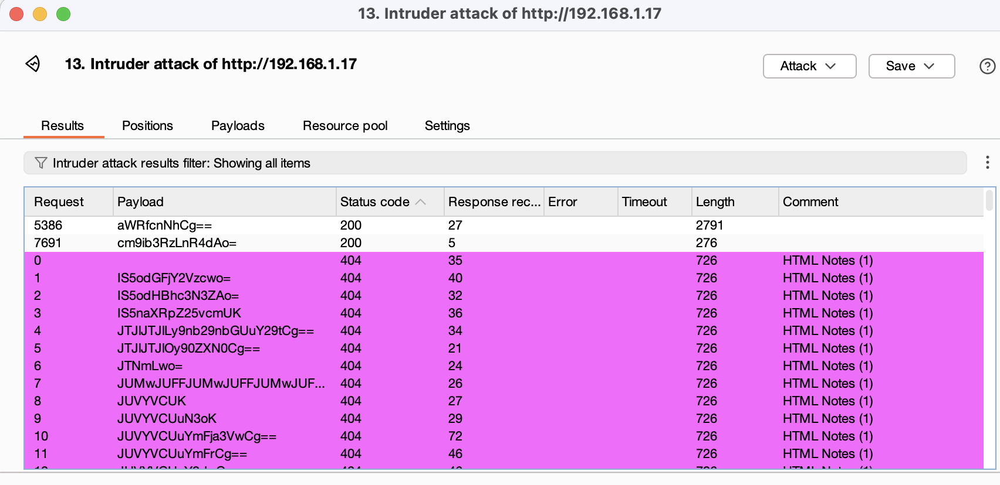
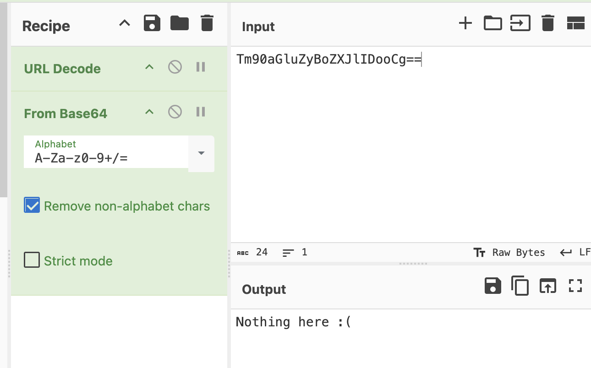
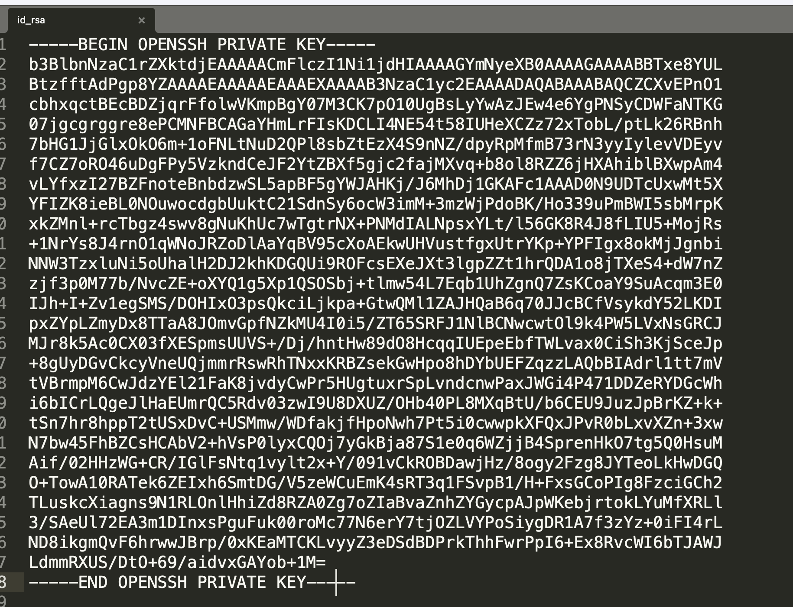
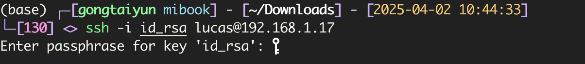
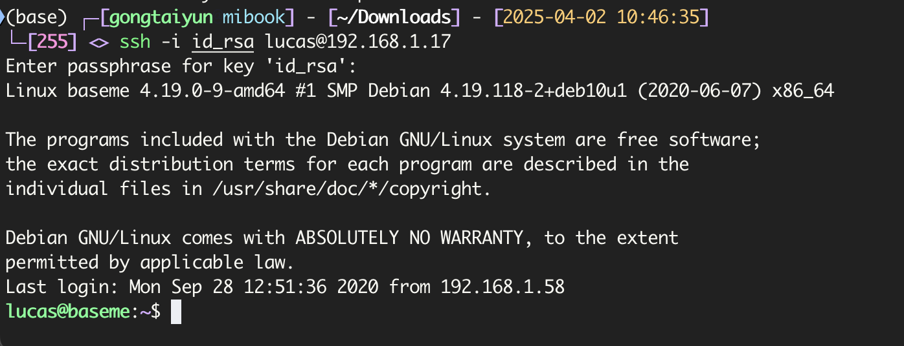
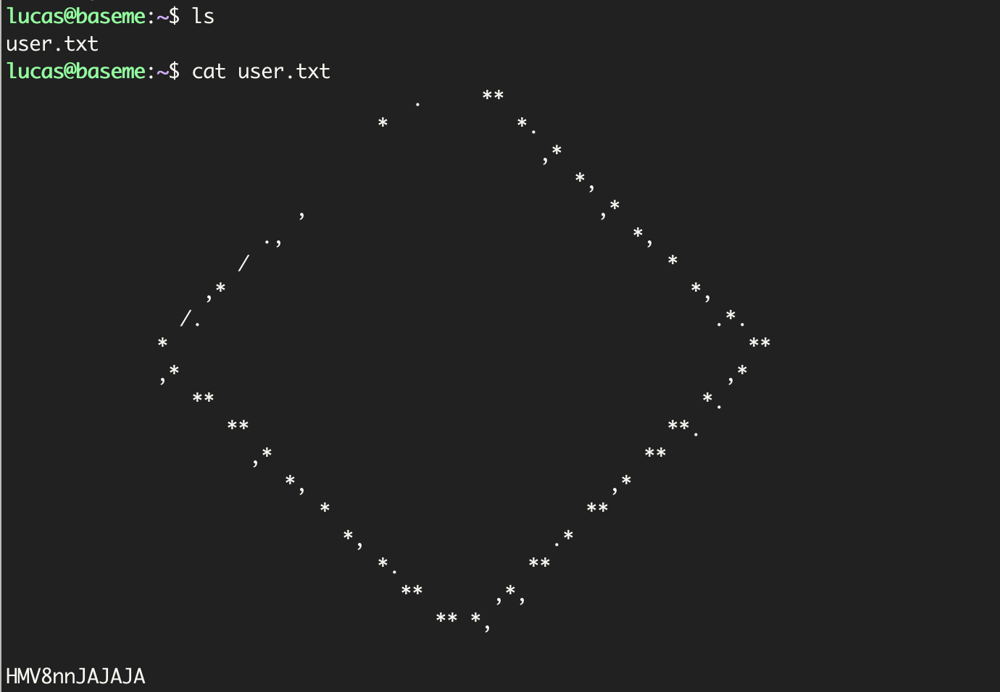

# BaseME

`fscan`扫描

```
192.168.1.17:80 open
192.168.1.17:22 open
[*] alive ports len is: 2
start vulscan
[*] WebTitle http://192.168.1.17       code:200 len:276    title:None
```

网页给了一串`base64`编码，解码后内容为

> ALL, absolutely ALL that you need is in BASE64.
> Including the password that you need :)
> Remember, BASE64 has the answer to all your questions.
> -lucas

扫目录也没有，看来是要用`base64`编码后的目录来扫，直接`base64`编码没扫出来，看了下别人的`wp`，需要加换行符一起`base64`，`burpsuite`的`Payload processing`可以`base64`但加`suffix`的时候加不了换行，直接自己转了，使用`AI`写很快，字典使用`dirsearch`里的字典

```python
import base64

def encode_lines_to_base64(input_file: str, output_file: str):
    # 读取原文件内容
    with open(input_file, "r", encoding="utf-8") as file:
        lines = file.readlines()
    
    # 对每一行添加换行符并进行Base64编码
    encoded_lines = [base64.b64encode((line.rstrip() + "\n").encode("utf-8")).decode("utf-8") for line in lines]
    
    # 将每一行编码后的内容写入新的txt文件
    with open(output_file, "w", encoding="utf-8") as file:
        file.write("\n".join(encoded_lines) + "\n")

# 调用函数并保存到文件
encode_lines_to_base64("dicc.txt", "encoded_lines_output.txt")
```

然后用字典去跑



一个解密说`Nothing here`



一个解密出来是私钥



`ssh`连上去需要私钥密码



猜测就是开始下面那句话的`base64`编码

```
iloveyou
youloveyou
shelovesyou
helovesyou
weloveyou
theyhatesme
```

还是加上回车后进行`base64`编码，结果第一个就是

```
aWxvdmV5b3UK
```



