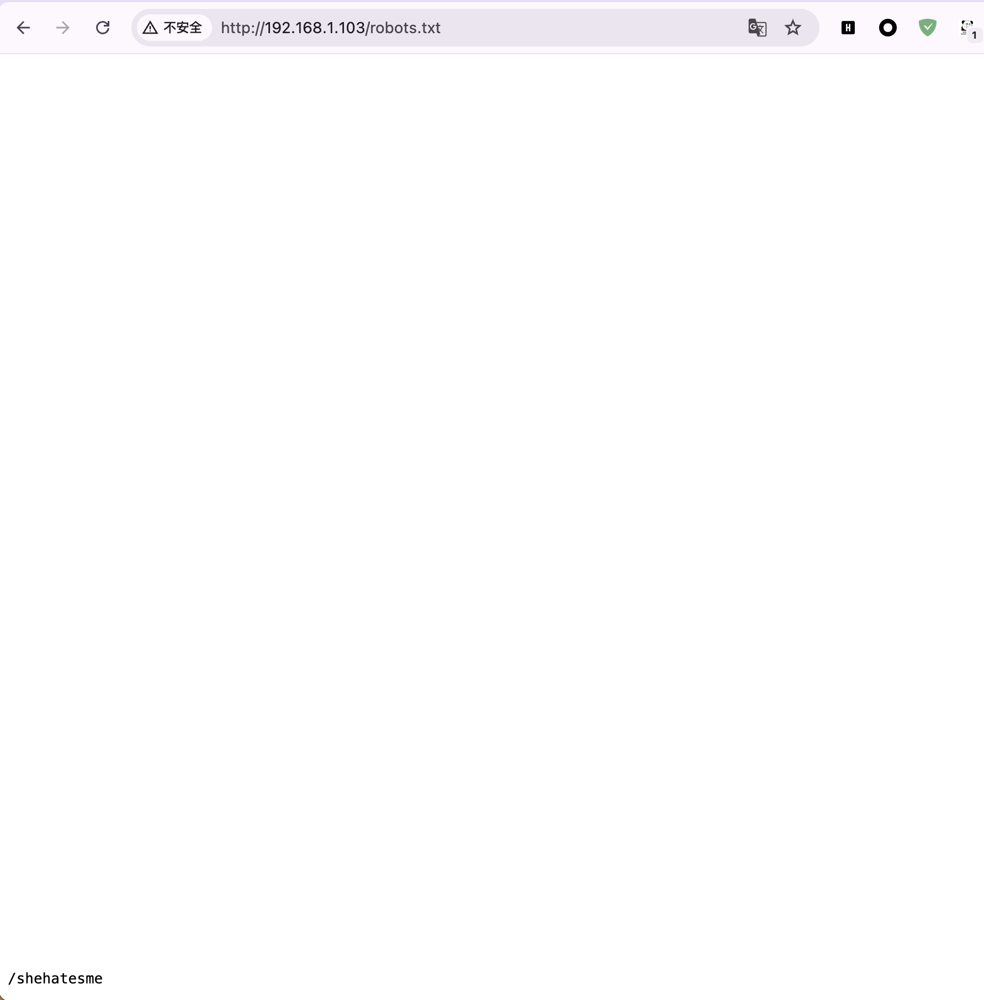
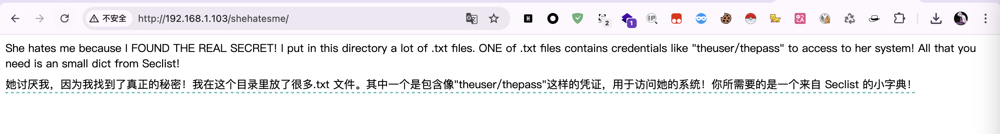
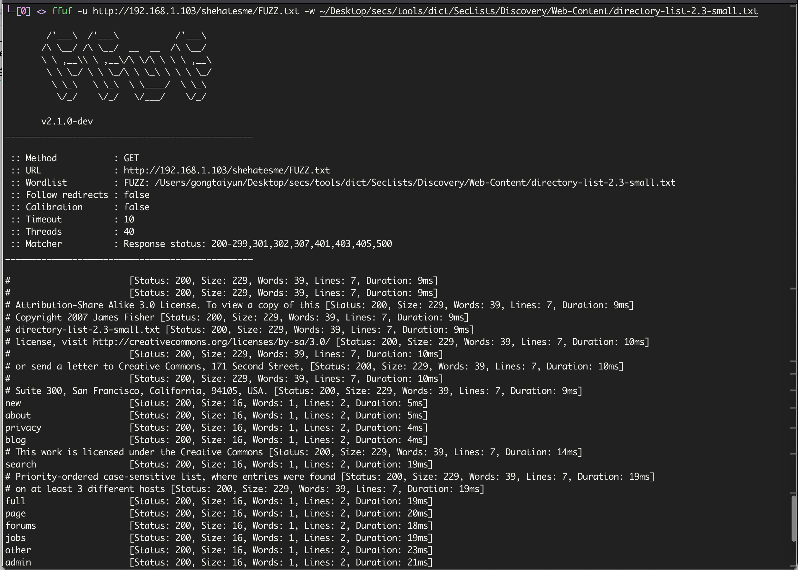
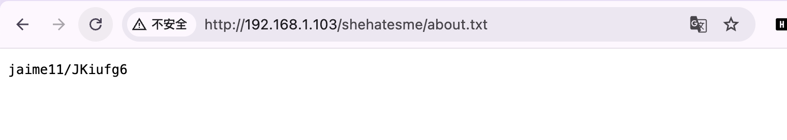
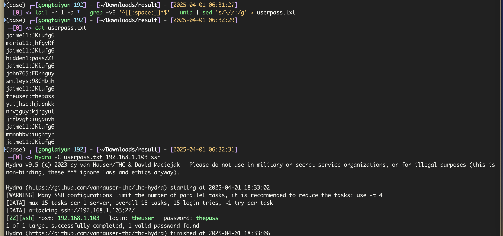
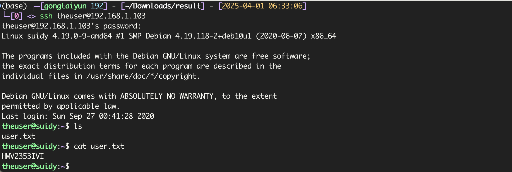

# Suidy

`fscan`扫描

```
192.168.1.103:22 open
192.168.1.103:80 open
```

首页只有个`hi`，使用`dirsearch`发现`robots.txt`，在最下面发现一个目录





[Seclist地址](https://github.com/danielmiessler/SecLists)

这里使用`ffuf`扫描，并将结果导出到`result`目录

```bash
ffuf -u http://192.168.1.103/FUZZ.txt -w ~/Desktop/secs/tools/dict/SecLists/Discovery/Web-Content/directory-list-2.3-small.txt -od result
```



在`about.txt`发现账号密码，每个都不一样,利用正则表达式将其提取出来

```bash
tail -n 1 -q * | grep -vE '^[[:space:]]*$' | uniq | sed 's/\//:/g' > userpass.txt
```



